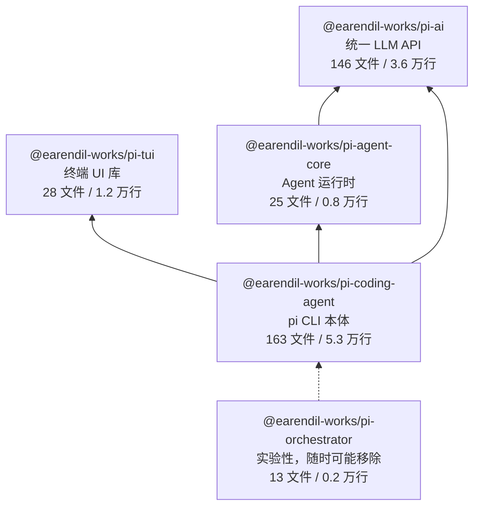
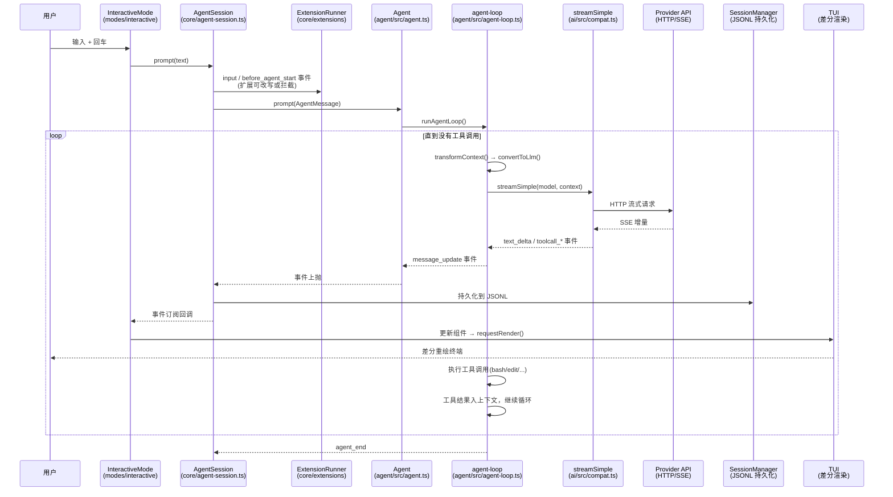
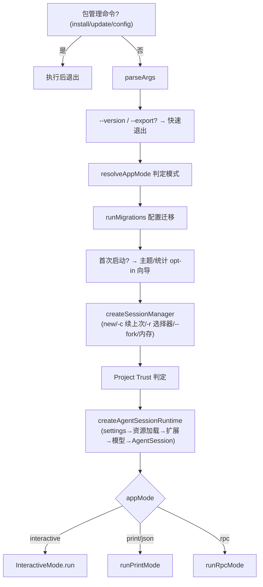
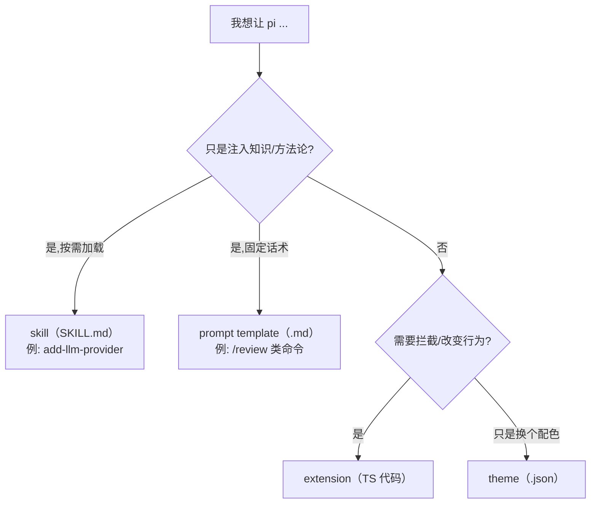

# Pi 全景地图 — 架构与原理（第 0 遍：浅而广）

> 本文是 pi-mono 学习系列的第 0 篇。目标是建立整体地图：五个包如何分层、一次 prompt 从敲回车到渲染完成经过哪些环节、复杂度集中在哪里。**本文故意不深入任何单个子系统**——每个子系统的深挖版是后续单独的文档（见第 10 章）。
>
> 所有 `文件:行号` 引用基于 commit `3f9aa5d1`（2026-07 的 main 分支）。文中代码路径均相对仓库根目录。

## 目录

- 第 1 章 这个项目是什么
- 第 2 章 五个包的全景图
- 第 3 章 一次 prompt 的完整生命周期（全书主线）
- 第 4 章 packages/ai — 统一 LLM API 层
- 第 5 章 packages/agent — Agent 运行时
- 第 6 章 packages/coding-agent core — pi 的心脏
- 第 7 章 三种前端形态（modes/）
- 第 8 章 packages/tui — 差分渲染终端 UI
- 第 9 章 扩展性体系 — pi 的立身之本
- 第 10 章 复杂度地图与深挖路线
- 第 11 章 用 pi 做扩展开发：可以往哪些方向思考
- 附录 A 读 pi 代码所需的 JS/TS 语法速查（零基础版）

---

## 第 1 章 这个项目是什么

pi 是一个终端里的 coding agent（同类产品：Claude Code、Codex CLI、OpenCode），由 Mario Zechner（badlogic）主导开发，归属 earendil-works。仓库是一个 npm workspaces monorepo，发布五个包，其中 `@earendil-works/pi-coding-agent` 就是用户敲 `pi` 命令时运行的 CLI 本体。

### 1.1 核心哲学：内核最小化

CONTRIBUTING.md 开篇明义（CONTRIBUTING.md:7-11）：

> **pi's core is minimal.** If your feature does not belong in the core, it should be an extension. PRs that bloat the core will likely be rejected.

这不是一句口号，而是贯穿代码的组织原则。你会在后面章节反复看到它的具体表现：

- 内核只有 7 个内置工具（bash/read/write/edit/grep/find/ls，见第 6.2 节），没有权限系统、没有 plan mode、没有子 agent——这些全部以扩展形式存在（`packages/coding-agent/examples/extensions/` 下有 plan-mode、subagent 等官方示例扩展）。
- 扩展系统的事件钩子多达 30+ 个（extensions/types.ts:1170-1211），内核宁可多开钩子也不内置功能。
- README.md:39 直接声明"pi 不含内置权限系统"，隔离靠容器化方案（Gondolin 微虚拟机 / Docker / OpenShell）解决，也是扩展。

读这个代码库时要带着这个视角：**凡是"这功能怎么不在内核里"的疑问，答案几乎都是"它是扩展"**。

### 1.2 一套代码，三种发行形态

pi 以三种方式运行同一套 TypeScript 源码（packages/coding-agent/docs/development.md:39）：

1. **npm 安装**：Node ≥ 22.19（package.json:54）直接执行 `.ts` 文件——依赖 Node 的 type stripping（类型擦除）能力，**不经过编译**。
2. **独立二进制**：Bun 打包的单文件可执行程序（`packages/coding-agent/src/bun/`）。
3. **源码直跑**：开发时用 `./pi-test.sh`，本质是 `tsx --tsconfig tsconfig.json packages/coding-agent/src/cli.ts`（pi-test.sh:57）。

这个约束反向塑造了代码风格，AGENTS.md:20 明文规定：**只能使用可擦除（erasable）的 TypeScript 语法**——禁止 `enum`、`namespace`、参数属性（parameter properties）、`import =` 等任何需要生成 JS 代码的构造。因为 Node strip-only 模式只会删掉类型标注，不会做代码变换。全库你看不到一个 `enum`，字符串字面量联合类型（如 `type Api = "openai-completions" | ...`）是唯一选择。

第二个连锁反应：**资源路径不能用 `__dirname` 硬推**。三种形态下包资源的位置完全不同，所以所有资源定位必须走 `packages/coding-agent/src/config.ts` 的 `getPackageDir()` 等函数（development.md:41-47 明确警告了这一点）。

### 1.3 供应链偏执

这个项目对 npm 供应链攻击的防御强度远超一般开源项目（README.md:61-73）：

- 所有直接外部依赖锁死精确版本，`.npmrc` 设 `save-exact=true` 和 `min-release-age=2`（拒绝解析发布不满 2 天的包版本）。
- 安装一律 `--ignore-scripts`，不执行任何依赖的生命周期脚本。
- pre-commit 钩子阻止意外提交 lockfile（需要 `PI_ALLOW_LOCKFILE_CHANGE=1` 显式放行）。
- 发布的 CLI 包附带从根 lockfile 生成的 `npm-shrinkwrap.json`，锁死终端用户的传递依赖；带生命周期脚本的新依赖必须进入 `scripts/generate-coding-agent-shrinkwrap.mjs` 的显式白名单，否则 `npm run check` 失败。

这解释了为什么 `npm run check`（package.json:16）里塞了 `check:pinned-deps`、`check:shrinkwrap`、`check:install-lock` 三个自定义脚本——它们和 lint/typecheck 同级别，是每次提交前的强制关卡。

---

## 第 2 章 五个包的全景图

### 2.1 依赖关系



（行数不含生成代码 `models.generated.ts` 等；orchestrator 的 README 自我声明"Experimental. may change or be removed without notice"，本文不再展开。）

构建顺序硬编码在根 package.json:15：`tui → ai → agent → coding-agent → orchestrator`。所有包**锁步版本发布**（AGENTS.md:122）：一次发布全部包一起升版本号，patch = 修复+新增，minor = 破坏性变更，没有 major。

### 2.2 分层原则：每一层不知道上一层的存在

这是整个架构最值得学的一点，各层的"无知"是刻意设计的：

| 包 | 知道什么 | 不知道什么 |
|---|---|---|
| `ai` | HTTP、SSE 流、各厂商 wire protocol | 什么是 agent、什么是工具循环 |
| `agent` | 消息、工具调用循环、事件流 | 终端、UI、会话文件、settings |
| `tui` | 终端转义序列、组件渲染 | LLM、agent、pi 的任何业务 |
| `coding-agent` | 以上全部 | —（它是缝合层） |

验证方式很简单：`packages/agent/src/` 下 grep 不到任何 `pi-tui` 的 import；`packages/tui/src/` 下 grep 不到任何 `pi-ai` 的 import。只有 `coding-agent` 同时 import 三者（例如 agent-session.ts:18-37 同时引 agent-core 和 ai，interactive-mode.ts:20-47 引 tui）。

这个分层的直接收益：`agent` + `ai` 可以脱离终端独立使用（这正是 SDK 用法，`packages/coding-agent/src/core/sdk.ts` 暴露 `createAgentSession()` 给程序化调用者），而 `tui` 是一个通用终端 UI 库，理论上可以给任何 CLI 用。

### 2.3 monorepo 之外

- `packages/coding-agent/examples/extensions/` 下的示例扩展是**独立 workspace 成员**（根 package.json:5-12），其中 gondolin（微虚拟机沙箱）、sandbox、custom-provider-anthropic 等有自己的 package.json——它们既是文档也是可安装的真实扩展。
- Slack/聊天自动化在另一个仓库 `earendil-works/pi-chat`（README.md:35）。

---

## 第 3 章 一次 prompt 的完整生命周期（全书主线）

这是理解 pi 的主线。后续所有章节都在放大这张图的某一段。

### 3.1 总时序图

以交互模式下用户输入"修复这个 bug"并回车为例：



### 3.2 事件流协议

整条链路的"血液"是一套统一的事件流。agent-loop 对每次运行 emit 的序列（agent-loop.ts:109-117 与 runLoop 主体 155-275）：

```
agent_start
└─ turn_start
   ├─ message_start / message_end        （用户消息）
   ├─ message_start                      （助手消息开始）
   ├─ message_update × N                 （流式增量：text_delta / thinking_delta / toolcall_delta...）
   ├─ message_end                        （助手消息完成）
   ├─ [工具执行事件]                     （如有 toolCall）
   └─ turn_end
└─ turn_start …                          （有工具结果则继续下一轮）
agent_end
```

三个关键设计点，都能在 runLoop（agent-loop.ts:155-275）里直接看到：

1. **双层循环**：内层循环（174 行）处理"工具调用 → 结果回填 → 再问 LLM"；外层循环（170 行）处理 follow-up——agent 本来要停了，但队列里还有用户排队的消息，就再来一轮（263-268 行）。
2. **steering（转向）**：每个 turn 结束后检查 `getSteeringMessages()`（259 行）——用户在 agent 干活时插话，消息会在下一次 LLM 调用前注入（182-190 行），而不是等整个任务结束。
3. **截断保护**：如果 LLM 响应因 token 上限被截断（`stopReason === "length"`），消息里的工具调用参数可能是残缺的——runLoop 会把这批工具调用**全部标记失败**而不是执行（207-214 行，注释原话："Fail them all instead of executing potentially borked calls"）。这是一个从实战踩坑得出的防御。

### 3.3 这张图的每一段在哪一章展开

| 时序图片段 | 对应章节 |
|---|---|
| streamSimple → Provider | 第 4 章（ai） |
| Agent / agent-loop | 第 5 章（agent） |
| AgentSession / ExtensionRunner / SessionManager | 第 6 章（coding-agent core） |
| InteractiveMode 及其兄弟（print/rpc） | 第 7 章（modes） |
| TUI 差分渲染 | 第 8 章（tui） |
| 扩展如何介入每个环节 | 第 9 章（扩展体系） |

---

## 第 4 章 packages/ai — 统一 LLM API 层

### 4.1 二维抽象：wire protocol × 厂商

大多数"统一 LLM 库"按厂商一家一个适配器。pi-ai 的做法是拆成两个维度：

- **`src/api/`** — wire protocol（线上协议）实现，只有 9 种（types.ts:15-24）：

  ```
  openai-completions       openai-responses        azure-openai-responses
  openai-codex-responses   anthropic-messages      bedrock-converse-stream
  google-generative-ai     google-vertex           mistral-conversations
  ```

- **`src/providers/`** — 厂商注册，约 35 家，每家一对文件：`<name>.ts`（指定用哪个 api、baseUrl、鉴权方式）+ `<name>.models.ts`（模型清单）。

为什么值得这么拆：Groq、Cerebras、DeepSeek、xAI、OpenRouter……市面上绝大多数厂商都说 OpenAI completions 方言。35 个厂商实际只需要 9 份协议实现，新增一个 OpenAI 兼容厂商约等于填一张表（仓库里甚至有现成技能 `.pi/skills/add-llm-provider.md` 指导 agent 自己加厂商——"自扩展"名副其实）。

`Api` 类型的定义有个巧妙细节（types.ts:26）：

```typescript
export type Api = KnownApi | (string & {});
```

`(string & {})` 让任意字符串合法（扩展可以注册自定义协议），同时保留 9 个已知值的 IDE 自动补全。

### 4.2 入口 API 与调用路径

四个入口全在 compat.ts:237-277：`stream` / `complete` / `streamSimple` / `completeSimple`。agent 层实际用的是 `streamSimple`（agent-loop.ts:304 的默认 streamFn）——"Simple" 指的是用统一的 `SimpleStreamOptions` 抹平各协议的参数差异（thinking 预算、缓存控制等），而非底层协议各自的原生选项。

调用路径：`streamSimple(model, context)` → 按 `model.api` 查注册表找到 api provider（compat.ts:266-267）→ 若调用方没给 apiKey，自动从环境变量兜底（`withEnvApiKey`，compat.ts:214-222，环境变量清单见 env-api-keys.ts）→ 返回 `AssistantMessageEventStream`，即 3.2 节那些 `text_delta`/`toolcall_delta` 事件的源头。

### 4.3 模型数据是生成的

`src/models.generated.ts` 是全库最大的文件之一，由 `packages/ai/scripts/generate-models.ts` 从上游模型数据库生成。AGENTS.md:24 有铁律：**永远不要手改这个文件**，要改就改生成脚本再重新生成。openrouter.models.ts（4,834 行）、vercel-ai-gateway.models.ts（3,225 行）这类文件同理——它们撑大了 ai 包的行数，但不是"需要读"的代码。

### 4.4 测试的关键角色：faux provider

`src/providers/faux.ts` 是一个假 provider，不发 HTTP、按脚本吐事件。coding-agent 的整个行为测试套件（`test/suite/`）靠它驱动（AGENTS.md:32 规定该目录禁止使用真实 API）。理解 faux 是读懂 pi 测试体系的钥匙。

### 4.5 鉴权

三条路：环境变量（env-api-keys.ts）、`~/.pi/agent/auth.json`（coding-agent 的 AuthStorage 管理）、OAuth 流程（`src/auth/` + oauth.ts，支持 Anthropic、GitHub Copilot、openai-codex 等订阅制登录）。仓库根的 test.sh:22-75 在跑测试前 unset 约 50 个 API key 环境变量并把 auth.json 挪走——这份清单本身就是 pi 支持的鉴权来源的完整枚举。

---

## 第 5 章 packages/agent — Agent 运行时

这是五个包里最小的一个（约 8,200 行），也是概念密度最高的一个。建议第一个深挖。

### 5.1 核心抽象：AgentMessage ≠ LLM Message

LLM 只认三种消息角色：`user`、`assistant`、`toolResult`。但一个真实应用的会话里还有别的东西：bash 执行记录、压缩摘要、扩展注入的自定义消息……

pi 的解法：agent 全程操作 `AgentMessage`（一个可通过 declaration merging 扩展的开放类型），只在 LLM 调用边界做两阶段转换（agent-loop.ts:288-295）：

```
AgentMessage[] ── transformContext() ──> AgentMessage[] ── convertToLlm() ──> Message[] ──> LLM
                  （可选：裁剪/注入）                        （必须：过滤+转换）
```

默认的 `convertToLlm` 就是把非三种角色的消息全部滤掉（agent.ts:32-36）。coding-agent 在此之上注入自己的转换逻辑，让压缩摘要等自定义消息以合适的形式进入 LLM 上下文。

**这一个设计决定了整个系统的可扩展性**：任何人可以往会话里塞任意类型的消息，只要提供转换规则，不用改内核。

### 5.2 agent-loop 的两个入口

- `agentLoop(prompts, ...)`（agent-loop.ts:31）：正常入口，带新消息启动。
- `agentLoopContinue(context, ...)`（agent-loop.ts:64）：不加新消息、从现有上下文续跑——重试场景用。它有一条运行时无法完全校验的约束（64-76 行的注释和 assert）：上下文的最后一条消息经 `convertToLlm` 后必须是 `user` 或 `toolResult`，否则 provider 会直接拒绝请求。

`Agent` 类（agent.ts）是这两个函数的有状态包装：持有 messages/tools/model 状态、暴露 `subscribe()` 订阅事件、通过 `AgentOptions`（agent.ts:97-120）注入所有定制点——`streamFn`（换掉 LLM 调用实现，测试就是从这里注入 faux）、`getApiKey`（每次调用动态取 key，为了过期令牌轮换，agent-loop.ts:306-308）、`beforeToolCall`/`afterToolCall`（工具拦截）、steering/followUp 队列模式。

### 5.3 harness/：agent 包里的"半成品应用层"

`src/harness/` 是比 `Agent` 高一层、比 coding-agent 低一层的东西：会话仓储（`session/`：JSONL 与内存两种实现）、压缩（`compaction/`）、skills 加载（skills.ts）、系统提示词组装（system-prompt.ts）、prompt templates。它存在的意义是让非 CLI 的宿主（比如 pi-chat）复用这些机制而不必依赖 coding-agent。文档在 `packages/agent/docs/`（agent-harness.md、durable-harness.md 等）。

值得记一个实现细节：JSONL 会话的条目短 ID 生成（harness/session/jsonl-storage.ts:36-44）——uuidv7 的前缀是时间戳派生的，相邻调用几乎相同，所以短 ID 取的是**末尾** 8 位随机段，冲突就重试，100 次后退化为完整 uuid。注释把原因写得明明白白，这是好代码的样子。

---

## 第 6 章 packages/coding-agent core — pi 的心脏

`src/core/` 约 40 个模块。中枢是 `AgentSession`。

### 6.1 AgentSession：所有模式共享的业务核心

agent-session.ts 的文件头注释（1-14 行）就是它的自我介绍：被所有运行模式（interactive/print/rpc）共享，封装 agent 状态访问、带自动持久化的事件订阅、模型与 thinking 级别管理、压缩（手动+自动）、bash 执行、会话切换与分支。**模式层只做 I/O，业务全在这**（interactive-mode.ts:1-4 的头注释也自证："delegating business logic to AgentSession"）。

3,246 行，全库第三大文件。它复杂的根本原因是"缝合层"职责：向下接 Agent 与工具，向上供三种模式，横向被 30+ 种扩展事件穿透，还要保证每个事件同步落盘。深挖 coding-agent 时它是主战场。

围绕它的装配线也值得留意：main.ts:615-739 的 `createRuntime` 工厂闭包 → `createAgentSessionServices`（组装 settings/模型注册表/资源加载器）→ `createAgentSessionFromServices`。工厂模式的原因：`/reload` 和会话切换需要在运行中重建整个 runtime。

### 6.2 内置工具：只有 7 个

`core/tools/` 导出 bash、edit、find、grep、ls、read、write（tools/index.ts:1-69），外加两个横切机制：

- `withFileMutationQueue`（file-mutation-queue.ts）：文件写操作串行化，防止并发工具调用互相踩踏。
- `truncate.ts`：统一的输出截断（`DEFAULT_MAX_BYTES`/`DEFAULT_MAX_LINES`），所有工具输出进 LLM 上下文前都过这一层。

每个工具都是 `create<X>Tool(operations)` 工厂 + 可注入的 `Operations` 接口（如 `BashOperations`）——这不是为了测试方便才留的缝，而是沙箱扩展（gondolin）把工具执行整体搬进虚拟机的接入点。

### 6.3 会话持久化：JSONL + 树

会话文件是 append-only 的 JSONL，版本 3（session-manager.ts:30）。第一行是 header（id/timestamp/cwd/parentSession），之后每行一个条目。关键：**每个条目有 `id` 和 `parentId`（session-manager.ts:46-51），所以会话不是线性日志而是一棵树**——用户可以回退到任意历史点开分支（`/tree` 导航、fork），同一文件里存着所有分支。

条目类型即功能清单（session-manager.ts:53-117）：

| 条目类型 | 用途 |
|---|---|
| `message` | AgentMessage 本体 |
| `model_change` / `thinking_level_change` | 中途换模型/换思考级别的审计记录 |
| `compaction` | 压缩摘要 + `firstKeptEntryId`（摘要替代该点之前的历史） |
| `branch_summary` | 切换分支时对被离开分支的总结 |
| `custom` | 扩展私有状态（不进 LLM 上下文） |
| `custom_message` | 扩展注入的消息（进 LLM 上下文） |
| `label` | 用户书签 |
| `session_info` | 会话显示名 |

`custom` 与 `custom_message` 的区分（session-manager.ts:90-104 注释写得很清楚）是扩展持久化的两条正路：存状态用前者，影响 LLM 用后者。

### 6.4 压缩（compaction）

上下文接近窗口上限时，`core/compaction/` 用 LLM 生成摘要写入 `compaction` 条目，之后构建上下文时旧历史被摘要替代。两个默认参数（settings-manager.ts:10-14）：`reserveTokens: 16384`（给摘要生成留的余量）、`keepRecentTokens: 20000`（无论如何保留的近期消息量）——这类数字是经验调出来的，没有理论依据，改之前先想清楚。扩展可以整体接管压缩策略（`session_before_compact` 事件）。

### 6.5 设置与信任模型

设置三层叠加：全局 `~/.pi/agent/settings.json` → 项目 `.pi/settings.json` → 运行时 CLI 参数。SettingsManager 由 `projectTrusted` 标志控制是否采纳项目层（main.ts:633）。

信任模型解决的问题：项目目录里的 `.pi/` 可能包含扩展（任意代码执行！），clone 一个恶意仓库然后跑 `pi` 不能等于中招。所以首次在含扩展等"需要信任的资源"的项目里启动时会弹确认（`ProjectTrustStore`，main.ts:601-608；`hasTrustRequiringProjectResources` 判定）。README.md:39 说 pi 没有权限系统，但**信任门禁是有的**——它管"要不要加载你的代码"，不管"加载后能干什么"。

### 6.6 系统提示词组装

buildSystemPrompt（system-prompt.ts:28）的叠加顺序：基础 prompt（或 `--system-prompt` 自定义）→ appendSystemPrompt → 项目上下文文件（AGENTS.md 等，包成 `<project_instructions path="...">` 标签，system-prompt.ts:60-68）→ skills 清单（仅当 read 工具可用，因为 skill 靠 read 加载正文，70-74 行）→ 当前日期和 cwd（76-78 行）。

---

## 第 7 章 三种前端形态（modes/）

同一个 AgentSession，三个壳（modes/index.ts 导出全部）：

### 7.1 模式判定

main.ts:100-111 的 `resolveAppMode`：显式 `--mode rpc/json` 直接生效；`-p`、或 **stdin/stdout 任一不是 TTY** 都降级为 print。所以 `echo "question" | pi` 和 `pi -p "question" > out.txt` 自动走单发模式，无需用户操心。另有一个补充规则（main.ts:768-773）：交互模式下若发现管道 stdin 有内容，当场改成 print。

### 7.2 interactive — TUI（默认）

`modes/interactive/interactive-mode.ts`，6,025 行，**全库最大文件**。订阅 AgentSession 事件流，把消息渲染成 TUI 组件，管理编辑器、快捷键、自动补全、overlay 选择器、主题。为什么这么大：终端交互的所有杂事都归它——OAuth 登录 UI、模型选择器、会话树导航、剪贴板图片、`/debug`、`!` bash 直通……它是"没有资格进内核的功能，但又必须存在于官方 UI"的沉积层。深挖时建议按功能切片读，不要从头读到尾。

### 7.3 print — 单发

`modes/print-mode.ts`（约 200 行，三种模式里最简单）：发 prompt → 等 agent_end → 输出 → 退出。`--mode json` 时输出全事件流 JSON 而非仅最终文本（print-mode.ts:17-19）。

### 7.4 rpc — 程序化嵌入

`modes/rpc/`：stdin 收 JSON 行命令，stdout 吐 JSON 行响应/事件（rpc-types.ts:1-6）。命令面即 AgentSession 公开能力的镜像（rpc-types.ts:20-72）：prompt/steer/follow_up/abort、模型与 thinking 切换、compact、bash、会话树操作（fork/clone/get_tree）……`rpc-client.ts` 是配套的 TS 客户端。这是把 pi 当子进程嵌进其他程序的正门，pi-chat 就这么用。

### 7.5 启动流程（main.ts 全景）

main.ts:473-859 的 `main()` 是一条长直线，值得画出来：



一个容易忽略的细节：会话可以属于另一个项目（`--session` 匹配到别的 cwd 的会话），此时项目级 settings/扩展/信任必须按**会话的 cwd** 而非当前 cwd 解析——main.ts:567-576 的注释专门解释了为什么 settings manager 要先建临时的再建正式的。这类"顺序敏感"是 main.ts 长的主要原因。

---

## 第 8 章 packages/tui — 差分渲染终端 UI

### 8.1 一个接口撑起整个 UI

核心抽象只有一个（tui.ts:64-88）：

```typescript
interface Component {
    render(width: number): string[];   // 给定宽度，返回行数组
    handleInput?(data: string): void;  // 可选：焦点时收键盘输入
    invalidate(): void;                // 清缓存，强制重渲
}
```

没有虚拟 DOM、没有布局引擎、没有 flexbox。组件就是"能变成字符串行数组的东西"。`components/` 下十来个实现：text、markdown、editor（2,333 行，带 kill-ring、undo 栈的完整编辑器）、select-list、box、image 等。

### 8.2 差分渲染

TUI 类（tui.ts:293 起）持有 `previousLines: string[]`（297 行），每次 `requestRender()`（712 行）把所有组件的输出行拼起来与上一帧逐行 diff，只重绘变化的行。渲染合并由 `renderRequested` 标志 + 定时器节流（306-307 行）。这就是 pi 在长会话中滚动不闪烁的原因——它从不整屏清空重画。

### 8.3 复杂度都在"终端兼容性"

tui 包 1.2 万行，大头不是组件而是和各种终端方言搏斗：`keys.ts` 1,400 行（Kitty 键盘协议、修饰键、legacy 转义序列的解析矩阵）、`terminal-image.ts`（Kitty 图片协议，tui.ts:21-59 甚至要解析图片转义头以正确 diff 含图行）、`terminal-colors.ts`（OSC 11 背景色查询→自动亮暗主题检测）。**判断**：这部分代码是靠真机测试喂出来的，不适合"读懂"，适合"需要时查"。

---

## 第 9 章 扩展性体系 — pi 的立身之本

### 9.1 四种资源

| 资源 | 形式 | 能力 |
|---|---|---|
| **extension** | TS/JS 模块，导出默认函数收 `ExtensionAPI` | 全能：事件钩子、注册工具/命令/快捷键/CLI 标志/provider、UI、改上下文 |
| **skill** | `SKILL.md` 目录（frontmatter: name + description） | 提示词层：清单进系统提示词，模型按需 read 全文 |
| **prompt template** | `.md` 文件 | `/名字` 斜杠命令展开为 prompt |
| **theme** | `.json` | 配色 |

发现顺序：内置 → 全局 `~/.pi/agent/` → 项目 `.pi/` → CLI 参数指定路径（`core/resource-loader.ts` 汇总）。分发用 pi packages：`pi install npm:@foo/bar` / `git:github.com/user/repo@v1` / 本地路径（docs/packages.md）。

### 9.2 ExtensionAPI：30+ 个事件钩子

extensions/types.ts:1170-1211 的 `on()` 重载清单就是内核暴露的全部切面，按生命周期分组：

- **会话**：`session_start` / `session_before_switch` / `session_before_fork` / `session_before_compact` / `session_compact` / `session_before_tree` / `session_shutdown`
- **agent 循环**（与第 3.2 节事件流一一对应）：`before_agent_start`（可改写/拦截 prompt）/ `agent_start` / `turn_start` / `message_update` / `turn_end` / `agent_end` / `agent_settled`
- **工具**：`tool_call`（可否决单次调用——权限扩展的实现点）/ `tool_execution_start/update/end` / `tool_result`（可改写结果）
- **底层**：`context`（直接改发给 LLM 的消息列表）/ `before_provider_headers` / `after_provider_response` / `input` / `user_bash` / `model_select`

注册面（types.ts:1218-1348）：`registerTool`（LLM 可调用的新工具）、`registerCommand` / `registerShortcut` / `registerFlag`、`registerMessageRenderer`（自定义消息的 TUI 渲染）、直到 `registerProvider`（注册新 LLM 厂商，含 OAuth——GitLab Duo 示例扩展就是纯扩展实现的完整 provider）。

动作面：`sendMessage` / `sendUserMessage`（deliverAs: steer/followUp/nextTurn，对应 5.2 节的队列语义）、`appendEntry`（持久化私有状态）、`setModel` / `setActiveTools` / `exec`。

**一句话总结这套设计**：第 3 章时序图里的每一根箭头，几乎都有对应的 before/after 钩子。这就是"内核最小化"的另一面——内核卖的不是功能，是切面。

### 9.3 UI 抽象跨三种模式

扩展 UI 走 `ExtensionUIContext`（types.ts:126-180）：`select` / `confirm` / `input` / `notify` / `setWidget` / `setStatus` / `setFooter`……**每种模式各自实现这套接口**（types.ts:123-125 注释）：interactive 弹真 TUI 对话框，rpc 转成 JSON 事件由宿主程序应答，print 给默认值。扩展因此不用关心自己跑在哪种模式下。

### 9.4 安全边界

docs/packages.md:20 的原话："Pi packages run with full system access. … Review source code before installing third-party packages."——扩展没有沙箱，唯一门禁是 6.5 节的 project trust（管加载，不管行为）。要真隔离，用 gondolin 扩展把工具执行搬进微虚拟机（README.md:41-45）。这是一个诚实但需要用户清醒认识的取舍。

---

## 第 10 章 复杂度地图与深挖路线

### 10.1 最大文件排名（实测，去除生成代码后）

| 行数 | 文件 | 成因判断 |
|---|---|---|
| 6,025 | coding-agent/modes/interactive/interactive-mode.ts | 交互杂事沉积层（见 7.2） |
| 3,246 | coding-agent/core/agent-session.ts | 缝合层本职（见 6.1） |
| 2,645 | coding-agent/core/package-manager.ts | npm/git/本地三种源 × 安装/更新/校验 |
| 2,333 | tui/components/editor.ts | 一个真编辑器该有的都有 |
| 1,714 | tui/tui.ts | 差分渲染 + 终端兼容 |
| 1,666 | coding-agent/core/extensions/types.ts | 30+ 事件的类型定义，读文档式代码 |
| 1,623 | coding-agent/core/session-manager.ts | JSONL 树 + 跨项目会话检索 |
| 1,568 | ai/api/openai-codex-responses.ts | Codex 订阅协议的脏细节 |
| 1,400 | tui/keys.ts | 终端键盘协议考古 |

规律很清楚：**复杂度不在 agent 引擎（整个 agent 包才 8,200 行），而在边缘——终端兼容、厂商方言、交互杂事**。引擎本身出奇地小而干净。

### 10.2 建议的深挖顺序（每篇一个独立会话）

1. **`01-agent.md` — agent 包**（先懂引擎，最小且概念密度最高）：agent-loop 双层循环逐段走读、AgentMessage 转换管道、steering/follow-up 队列语义、EventStream 实现、harness 的会话仓储与压缩。
2. **`02-ai.md` — ai 包**：streamSimple 到一个具体 api（建议 anthropic-messages.ts 或 openai-completions.ts）的完整调用链、事件流如何从 SSE 组装、注册表机制、OAuth 流程、faux provider。
3. **`03-coding-agent-core.md`**：AgentSession 全文走读、工具实现与 Operations 注入、JSONL 会话树的构建/fork/压缩交互、settings 与 trust。
4. **`04-modes-and-tui.md`**：InteractiveMode 按功能切片 + TUI 差分渲染细节 + RPC 协议。
5. **`05-extensions.md`**：ExtensionRunner 事件分发实现（runner.ts）、loader 的模块加载（jiti）、以 plan-mode 和 gondolin 两个官方示例扩展作案例走读。

以及两篇可选的横切主题（不按包切分，跨越多层，通用价值最高）：

6. **`06-testing.md` — 如何确定性地测试一个 agent**：`test/suite/harness.ts` + faux provider 如何把非确定性的 agent 循环变成可断言的确定性系统（170+ 测试文件零 API 消耗）；`test/suite/regressions/` 按 issue 编号命名的回归测试目录——读一遍等于读一遍"coding agent 在真实世界里都怎么坏的"案例集。这是全项目最值得移植到自己项目的工程实践。
7. **`07-robustness-and-cost.md` — 健壮性与成本工程**：重试体系（`RetrySettings` 的指数退避，settings-manager.ts:27-32；`isRetryableAssistantError` 的可重试错误判定；重试如何依赖 `agentLoopContinue` 的上下文合法性约束）、上下文溢出触发自动压缩的链路（`isContextOverflow`），以及 prompt 缓存经济学（`core/cache-stats.ts` + `ai/src/api/openai-prompt-cache.ts`——Anthropic 显式缓存断点 vs OpenAI 自动前缀缓存两种机制，缓存命中与否直接决定成本数量级；commit 3f9aa5d1 刚加入缓存未命中跟踪，说明维护者自己也在盯这个数字）。

### 10.3 上手实验建议

读文档不如跑代码，三个低成本实验：

```bash
./pi-test.sh -p "hello"            # 最短路径：print 模式，对照第 3 章时序图加 console.error 观察事件
./pi-test.sh --mode json "hello"   # 直接看事件流 JSON，验证 3.2 节的事件序列
cat ~/.pi/agent/sessions/<项目目录名>/*.jsonl | head -5   # 亲眼看 6.3 节的会话格式
```

写一个 10 行的 hello-world 扩展（`.pi/extensions/hello.ts`，注册一个 `/hello` 命令）是理解第 9 章最快的方式——扩展 API 的文档在 `packages/coding-agent/docs/extensions.md`。

### 10.4 三个不必成篇、但值得留意的横切主题

- **项目的自举机制**：仓库自带 `.pi/prompts/`（cl/wr/pr/is/sa 五个提示词模板）和 `.pi/skills/add-llm-provider.md`，加上 AGENTS.md 里"多个 pi 会话同时在此目录工作，禁止 `git add -A`"这类规则（AGENTS.md:47-59），合起来是一份"维护者如何用 pi 开发 pi"的完整工作流标本。价值不在代码，在于照着搭自己项目的 agent 工作流。
- **OAuth 订阅鉴权**：`ai/src/auth/` + oauth.ts 是 Anthropic 订阅、GitHub Copilot、OpenAI Codex 三家 OAuth 流程的完整实现。想写任何"复用已有订阅额度"的工具，这是现成教材，小众但难找到第二份。
- **orchestrator 包（观察，勿精读）**：2,000 行、自称实验性，但 supervisor.ts、`ipc/`、rpc-process.ts 的文件名已经暴露方向——多 pi 进程的编排与监督，这是项目的下一步棋。现在读不值，每次同步 upstream 时瞄一眼它的 diff，能看着一个多 agent 编排系统从零长出来。

**反向清单（明确不值得深挖）**：各厂商 `.models.ts` 数据表（生成物，见 4.3 节）；package-manager.ts 的 2,645 行（npm/git 安装管道，纯工程苦力）；tui 的终端兼容性代码（keys.ts 的 1,400 行是考古现场，需要时查即可）。

---

## 第 11 章 用 pi 做扩展开发：可以往哪些方向思考

pi 的设计决定了"给 pi 写扩展"约等于"给 coding agent 加任何你想要的行为"。本章不教怎么写（那是 `packages/coding-agent/docs/extensions.md` 的 1,600 行正文和约 75 个官方示例的事），而是回答一个更前置的问题：**拿到这套钩子体系，值得往哪些方向想？**

每个方向都标注了官方示例（全部在 `packages/coding-agent/examples/extensions/` 下，README.md 按同样的类别分组），可以直接 `pi -e examples/extensions/<名字>.ts` 试跑。

### 11.1 先选对机制：不是所有需求都需要扩展

四种资源的能力边界差异很大（见 9.1 节），先问自己"我要改变的是什么"：



判断标准很简单：**skill 和 prompt template 是"说给模型听的"，extension 是"改变系统做的"**。想拦截危险命令、加新工具、接新厂商，只能用 extension；想教会模型"本团队怎么写提交信息"，一个 skill 就够，写扩展是杀鸡用牛刀。

### 11.2 方向一：安全与管控 —— 补上 pi 故意不做的权限系统

pi 内核没有权限系统（README.md:39），这是留给扩展的最大空位。切入点是 `tool_call` 事件——它能**否决单次工具调用**（9.2 节），等于在 LLM 和真实世界之间装闸门。

官方示例展示的梯度，从轻到重：

| 示例 | 思路 |
|---|---|
| `permission-gate.ts` | 匹配危险 bash 命令（rm -rf、sudo...）弹确认框 |
| `protected-paths.ts` | 禁止写入 .env、.git/、node_modules/ 等路径 |
| `dirty-repo-guard.ts` | 工作区有未提交改动时阻止切换会话 |
| `sandbox/` | 用 `@anthropic-ai/sandbox-runtime` 做 OS 级沙箱 |
| `gondolin/` | 整个工具执行搬进 Linux 微虚拟机 |

**可深挖的方向**：企业合规审计日志（`tool_execution_end` 全量记录）、按项目的策略文件（结合 project trust）、敏感信息出站检测（`before_provider_headers` / `context` 事件里扫描要发给 LLM 的内容）。

### 11.3 方向二：自定义工具 —— 给 LLM 新的手脚

`registerTool`（extensions/types.ts:1218）注册的工具和内置 7 件套完全平等：出现在系统提示词里、LLM 可直接调用、有自己的 TUI 渲染。三个思考层次：

1. **加新能力**：`todo.ts`（待办清单工具 + 状态持久化到 `custom` 条目）、`truncated-tool.ts`（包一层 ripgrep）。凡是"我总在让 agent 跑同一类 bash 命令"的场景，都值得固化成带 schema 的工具——参数校验、输出截断、专属渲染都是白送的。
2. **改造旧能力**：`tool-override.ts` 演示覆写内置 read 加访问控制/日志。内置工具的 `Operations` 注入接口（6.2 节）是官方留的缝。
3. **换执行位置**：`ssh.ts` 把全部工具委托到远程机器执行——本地 TUI、远程干活。gondolin 的微虚拟机方案本质上是同一思路的重型版。

**可深挖的方向**：对接内部系统的工具（查工单、查监控、发布流水线）、`structured-output.ts` 展示的"终结型工具"（`terminate: true` 让 agent 以结构化结果收尾——做程序化流水线的关键原语）。

### 11.4 方向三：工作流编排 —— 把"用法"固化成"功能"

这个方向的公式是：**你使用 pi 的某种成熟套路 + 扩展 API = 一个新功能**。官方示例里最有分量的三个都属于此类：

- `plan-mode/`：Claude Code 式计划模式——只读探索 + `/plan` 命令 + 步骤跟踪。实现原理就是 `setActiveTools` 动态收窄工具集 + 自定义命令。
- `subagent/`：子 agent 委托——用隔离的上下文窗口跑子任务（scout/planner/worker/reviewer 四个预置角色）。原理是扩展内部再起 AgentSession（SDK 用法，6.1 节）。
- `handoff.ts`：`/handoff <目标>` 把当前上下文精炼后转移到新会话——对抗上下文膨胀的另一种解法。

配套的仪式性自动化也在这类：`git-checkpoint.ts`（每个 turn 自动打 git 快照）、`auto-commit-on-exit.ts`、`preset.ts`（模型+工具+指令的命名预设，`--preset` 一键切换）。

**可深挖的方向**：团队工作流的编码化——比如"需求 → 计划 → TDD → 审查"的强制流程（用 `before_agent_start` 拦截 + 状态机 + `custom` 条目持久化阶段）；多 agent 协作拓扑（subagent 示例是单层委托，可以做成流水线或辩论式）。

### 11.5 方向四：上下文工程 —— 控制 LLM 看到什么

`context` 事件（extensions/types.ts:657 附近定义）允许**直接改写发给 LLM 的消息列表**，加上 `session_before_compact` 可整体接管压缩策略，这是扩展能触及的最底层：

- `custom-compaction.ts`：替换默认压缩算法（6.4 节的摘要式压缩只是默认实现）。
- `input-transform.ts` / `input-transform-streaming.ts`：改写用户输入（展开自定义语法、注入检索结果）。
- `claude-rules.ts`：把 Claude Code 的 CLAUDE.md 规则文件桥接进 pi——**迁移别家生态的资产**是个被低估的方向。
- `system-prompt-header.ts`、`trigger-compact.ts`：微调系统提示词、手动触发压缩。

**可深挖的方向**：RAG 注入（`before_agent_start` 时检索代码库/文档，作为 `custom_message` 进上下文）、上下文预算管理（按 token 用量动态裁剪，`ctx.getContextUsage()` 提供数据）、会话记忆（跨会话提取事实存本地，新会话自动注入——正是 Claude Code memory 的玩法，pi 内核不做，恰好留给扩展）。

### 11.6 方向五：接入新模型与厂商

`registerProvider`（extensions/types.ts:1328）能注册完整厂商：自定义 baseUrl、模型清单、OAuth 登录、甚至自定义 wire protocol（`streamSimple` 覆写）。两个官方示例即真实产品级实现：

- `custom-provider-anthropic/`：演示标准做法（有独立 package.json，是 workspace 成员）。
- `custom-provider-gitlab-duo/`：纯扩展实现的 GitLab Duo 完整接入，含 OAuth。

**可深挖的方向**：公司内部 LLM 网关接入（统一鉴权/计费/审计的代理层，配 `before_provider_headers` 加内部头）、本地模型编排（按任务难度自动路由 ollama/云端，`model_select` + `prepareNextTurn` 换模型的能力在 5.2 节提过）。

### 11.7 方向六：UI 与集成 —— pi 作为一个"壳"

TUI 原语（9.3 节的 `ExtensionUIContext`）的自由度比想象的大——官方示例里有 `snake.ts`、`space-invaders.ts`、`doom-overlay/`（真的在终端 overlay 里跑 Doom），它们存在的意义就是证明 UI 层没有天花板。严肃用途：

- 状态可视化：`status-line.ts`（footer 显示 turn 进度）、`custom-footer.ts`、`widget-placement.ts`。
- 输入增强：`github-issue-autocomplete.ts`（输入 `#1234` 自动补全 GitHub issue——叠加自定义 autocomplete provider）、`modal-editor.ts`（vim 式模态编辑）。
- 对外集成：`notify.ts`（任务完成系统通知）、`file-trigger.ts`（监听文件变化触发 prompt——CI/看门狗玩法）、`rpc-demo.ts` 配合第 7.4 节的 RPC 模式把 pi 嵌进任意程序。

**可深挖的方向**：编辑器/IDE 桥（RPC 模式 + 编辑器插件，pi 当后端）、聊天平台桥（参考 earendil-works/pi-chat 的做法）、多会话仪表盘（orchestrator 包正在实验的方向）。

### 11.8 落地清单：从想法到发布

1. **开发循环**：单文件起步，`pi -e ./my-ext.ts` 临时加载（不落配置）；改代码后 `/reload` 热重载（main.ts 的 runtime 工厂就是为此设计的，见 6.1 节）。
2. **调试**：`pi --mode json` 看事件流验证钩子时序；`/debug` 命令 dump TUI 渲染和发给 LLM 的消息（development.md:49-53）。
3. **状态持久化**：进 LLM 上下文用 `sendMessage`/`custom_message`，不进上下文用 `appendEntry`/`custom` 条目（6.3 节的区分），重载时扫描条目重建状态。
4. **模式兼容**：记得扩展会跑在 print/RPC 模式下——UI 调用前查 `ctx.hasUI`，否则给默认行为。
5. **发布**：包成 pi package（`package.json` 加 `pi` 清单 + `pi-package` 关键字，docs/packages.md），`pi install npm:...` 或 git 直装；核心包依赖声明为 `peerDependencies: "*"`（packages.md:170）。
6. **安全自觉**：你的扩展在用户机器上拥有完整系统权限（packages.md:20），第三方装你的包靠的是信任——代码保持可审计，别做 curl | bash 式的事。

### 11.9 一个判断：什么样的扩展有价值

回看官方约 75 个示例，真正被广泛使用的是那些**把 pi 内核故意不做的事补上**的：权限门禁、plan mode、子 agent、沙箱、厂商接入。换句话说，pi 的"内核最小化"哲学（1.1 节）同时是一张**扩展机会清单**——凡是别的 coding agent 内置而 pi 没有的功能，都是一个现成的、有明确参照物的扩展题目。反过来，纯提示词层面的定制（编码规范、审查清单）不要写成扩展，一个 skill 更便宜也更容易维护。

---

## 附录 A 读 pi 代码所需的 JS/TS 语法速查（零基础版）

假设你会至少一门编程语言但从没写过 JavaScript/TypeScript。本附录**只覆盖 pi 代码里高频出现的语法**，每条尽量配一段仓库里的真实代码。TypeScript = JavaScript + 类型标注，运行时类型会被擦掉（pi 正是靠"只擦类型、不变换代码"跑 .ts 文件的，见 1.2 节），所以先讲 JS 部分再讲类型部分。

### A.1 变量与基本值

```typescript
const x = 5;        // 常量，不能重新赋值（但对象内容可改！见 A.4）
let y = "hi";       // 变量，可重新赋值
```

pi 代码几乎全用 `const`（没有 `var`，那是历史遗留写法）。两个"空值"要分清：

- `undefined`：没有值（未赋值的变量、不存在的属性、没有 return 的函数返回值）
- `null`：显式的空（代码里主动写的）

pi 主要用 `undefined`（比如可选参数、"未设置"的语义），`null` 少见（如 session-manager.ts:49 的 `parentId: string | null`，树根节点的父指针）。

字符串模板用反引号，`${}` 里可以放任意表达式：

```typescript
console.error(`Failed to load extension "${path}": ${error}`)   // main.ts:686
```

### A.2 函数的三种写法

```typescript
// 1. 普通函数声明
function parseArgs(args: string[]): Args { ... }

// 2. 箭头函数（最常见）—— 参数 => 返回值
const double = (n: number) => n * 2;          // 单表达式，自动 return
const f = (n: number) => { return n * 2; };   // 带花括号则需要显式 return

// 3. 作为参数的匿名箭头函数（回调）
messages.filter((message) => message.role === "user")
```

真实例子——agent 包的默认消息过滤（agent.ts:32-36）：

```typescript
function defaultConvertToLlm(messages: AgentMessage[]): Message[] {
    return messages.filter(
        (message) => message.role === "user" || message.role === "assistant" || message.role === "toolResult",
    );
}
```

读法：`filter` 遍历数组，把回调返回 true 的元素留下，返回**新数组**。同族的还有 `map`（逐个变换）、`find`（找第一个匹配）、`some`（是否存在匹配）、`flatMap`（变换后拍平）——pi 里这四个到处都是，它们都不修改原数组。

### A.3 对象与解构

对象字面量就是键值对，属性访问用点号：

```typescript
const options = { mode: "text", messages: [] };
options.mode          // "text"
```

**解构（destructuring）是 pi 代码里最高频的语法**，作用是把对象的属性一次性拆到同名变量里：

```typescript
const { services, session, modelFallbackMessage } = runtime;      // main.ts:747
// 等价于：
// const services = runtime.services;
// const session = runtime.session;
// const modelFallbackMessage = runtime.modelFallbackMessage;
```

函数参数位置也能解构（很多函数签名长这样）：

```typescript
const createRuntime = async ({ cwd, agentDir, sessionManager }) => { ... }   // main.ts:615-621
```

数组同理：`const [key, value] = param.split("=", 2)`（tui.ts:40）。

### A.4 展开运算符 `...`：不可变更新的引擎

`...` 把一个对象/数组的内容"摊开"进新的对象/数组。pi 用它做**不修改原对象的更新**：

```typescript
// agent-loop.ts:310-314 —— 复制 config 的所有字段，再覆盖 apiKey 和 signal
const response = await streamFunction(config.model, llmContext, {
    ...config,
    apiKey: resolvedApiKey,
    signal,
});
```

注意最后的 `signal,` ——属性名和变量名相同时可以简写（等价于 `signal: signal`），这个简写 pi 里遍地都是。

数组版：`[...context.messages, ...prompts]`（agent-loop.ts:106）= 两个数组拼接成新数组。`.slice()`（agent.ts:70-71）是另一种复制数组的写法。为什么总在复制？因为 `const` 只锁引用不锁内容，想避免共享可变状态就得复制——这是 JS 的习惯法。

### A.5 `?.`、`??`、`||`：三个防空运算符

这三个符号不认识的话，pi 一行代码都读不下去：

```typescript
a?.b          // a 是 undefined/null 时整个表达式为 undefined，不报错；否则取 a.b
a?.()         // a 存在才调用它（可选调用！）
a ?? b        // a 是 undefined/null 时用 b，否则用 a
a || b        // a 是"假值"(undefined/null/0/""/false)时用 b —— 比 ?? 更宽
```

真实例子一网打尽（agent-loop.ts:167）：

```typescript
let pendingMessages: AgentMessage[] = (await config.getSteeringMessages?.()) || [];
```

读法：`config.getSteeringMessages` 这个回调**可能没配置**——配置了就调用并 await 结果，没配置得到 undefined，`|| []` 兜底成空数组。一行代码处理了"钩子可选"的整个逻辑。

再如默认值填充（agent.ts:74-76）：

```typescript
systemPrompt: initialState?.systemPrompt ?? "",
```

### A.6 async/await 与 Promise

JS 是单线程 + 事件循环模型，所有 I/O 都是异步的。`Promise<T>` ≈ "将来会给你一个 T"，`async/await` 是它的语法糖：

```typescript
async function main() {                        // async 函数的返回值自动包成 Promise
    const sessions = await SessionManager.list(cwd);   // await = 挂起等结果，不阻塞线程
}
```

三个 pi 里常见的变体：

```typescript
// 1. 故意不等待（fire-and-forget）：void 前缀显式丢弃 Promise
void runAgentLoop(...).then((messages) => { stream.end(messages); });   // agent-loop.ts:40-51

// 2. 异步迭代：流式消费事件（agent-loop.ts:319）
for await (const event of response) {
    switch (event.type) { ... }
}

// 3. 手动构造 Promise（把回调风格的旧 API 包成 await 可用）
return new Promise((resolve) => {
    rl.question(`${message} [y/N] `, (answer) => { resolve(answer === "y"); });
});                                                                      // main.ts:193-202
```

第 2 个尤其重要：**第 3.2 节的事件流就是靠 `for await` 消费的**，`AssistantMessageEventStream` 是一个异步迭代器。

### A.7 类、getter/setter、Map/Set

类和其他语言差不多，值得注意的是属性拦截器（agent.ts:77-88）：

```typescript
get tools() { return tools; },                       // 读 obj.tools 时执行
set tools(nextTools: AgentTool<any>[]) { tools = nextTools.slice(); },  // 写时执行（这里顺手做了防御性复制）
```

容器类：`new Map<string, boolean>()`（键值表，main.ts:608）、`new Set<string>()`（去重集合，agent.ts:91）。注意 Map 用 `.get()/.set()`，不能用方括号。

### A.8 模块：import / export

pi 全库是 ESM（ES Modules）。文件顶部 import，需要共享的东西加 export：

```typescript
import { runAgentLoop } from "./agent-loop.ts";          // 具名导入（相对路径，带 .ts 后缀）
import { Agent } from "@earendil-works/pi-agent-core";   // 从 npm 包导入
import type { AgentEvent } from "./types.ts";            // 只导入类型（运行时会被完全擦掉）
```

`import type` 在 pi 里极多——因为类型擦除模式下，必须明确区分"运行时真的需要这个模块"和"只是用它的类型"。另外回忆 AGENTS.md:18 的项目铁律：禁止内联 `await import()`，只允许顶部导入。

---

### A.9 类型标注：冒号语法

以下进入 TypeScript 部分。基本形式是 `名字: 类型`：

```typescript
function resolveSessionPath(sessionArg: string, cwd: string): Promise<ResolvedSession>
//                          参数: 类型                        返回值类型
const diagnostics: AgentSessionRuntimeDiagnostic[] = [];     // 数组类型：T[]
```

常用原始类型：`string`、`number`、`boolean`、`unknown`（未知，用前必须收窄）、`any`（放弃检查——AGENTS.md:15 规定尽量别用）、`void`（无返回值）。

### A.10 interface 与 type：描述对象的形状

```typescript
interface SessionHeader {          // session-manager.ts:32-39
    type: "session";
    version?: number;              // ? = 可选属性，可能是 undefined
    id: string;
    cwd: string;
    parentSession?: string;
}

type ResolvedSession = ...         // type 是类型别名，能表达 interface 之外的联合等形式
```

区别不用纠结：描述对象形状两者都行，**联合类型只能用 type**。`?` 后缀（可选属性）要和 A.5 的防空运算符连起来理解——正因为到处是可选属性，才到处是 `?.` 和 `??`。

### A.11 联合类型与字符串字面量类型：pi 的"枚举"

TS 里一个字符串本身可以是类型。pi 因为禁用 `enum`（1.2 节），**所有枚举语义都用字符串字面量联合表达**：

```typescript
type KnownApi = "openai-completions" | "anthropic-messages" | ... ;   // types.ts:15-24
mode: "text" | "json"                                                  // print-mode.ts:19
```

### A.12 可辨识联合 + switch 收窄：读懂事件系统的钥匙

**这是读 pi 代码最重要的一个类型模式。**多个类型共享一个字面量字段（惯用 `type`），组成联合；`switch` 该字段时，TS 在每个分支里自动知道具体是哪个类型：

```typescript
// RpcCommand 就是典型（rpc-types.ts:20-72）：
type RpcCommand =
    | { id?: string; type: "prompt"; message: string; images?: ImageContent[] }
    | { id?: string; type: "abort" }
    | { id?: string; type: "set_model"; provider: string; modelId: string }
    | ...

// 消费端（agent-loop.ts:319-346 同款模式）：
switch (event.type) {
    case "text_delta":
        // 这个分支里 TS 知道 event 一定有 delta 字段
        break;
    case "toolcall_end":
        // 这里则是 toolcall 形状
        break;
}
```

第 3.2 节的 AgentEvent、第 9.2 节的全部扩展事件、会话条目 SessionEntry——**pi 所有的"消息/事件"都是这个模式**。看到 `type: "xxx"` 字段就要条件反射：这是可辨识联合的标签。

### A.13 泛型：尖括号里的类型参数

和 Java/C# 泛型同概念：

```typescript
new Map<string, boolean>()                      // 容器泛型
Promise<AssistantMessage>                       // 异步结果类型
function streamSimple<TApi extends Api>(model: Model<TApi>, ...)   // compat.ts:258
//                    ^类型参数    ^约束: TApi 必须是 Api 的子类型
interface CompactionEntry<T = unknown> { details?: T }             // session-manager.ts:69，= 是默认值
```

pi 的泛型大多服务于"扩展塞自定义数据"：`CustomEntry<T>`、`registerTool<TParams>` 等，让扩展的私有类型能穿过内核而不丢失检查。

### A.14 类型收窄与断言

```typescript
if (error instanceof Error) { error.message }        // instanceof 收窄（main.ts:238 同款到处都是）
if (typeof parsed !== "object" || parsed === null)   // typeof 收窄（jsonl-storage.ts:65）
value as TOptions                                     // as = 强制断言"相信我"，绕过检查，读到时留个心眼
apiKey is string                                      // 返回类型里的 is：类型谓词，函数返回 true 则参数被收窄
                                                      // （compat.ts:210 hasExplicitApiKey）
x satisfies Model<any>                                // satisfies：检查 x 符合该类型但不改变 x 的推导类型
                                                      // （agent.ts:58）
```

`===`/`!==` 是严格相等（不做类型转换），JS 里永远用这个，别用 `==`。

### A.15 函数类型与回调签名

类型位置的 `=>` 描述"这是一个函数"：

```typescript
// agent.ts:100 —— transformContext 是一个可选属性，值是函数：
transformContext?: (messages: AgentMessage[], signal?: AbortSignal) => Promise<AgentMessage[]>;

// 返回函数的函数（订阅模式，返回值是"取消订阅"函数）：
onTerminalInput(handler: TerminalInputHandler): () => void;    // extensions/types.ts:140
```

pi 的扩展 API、Agent 的全部定制点（5.2 节）都是这种"配置对象里塞回调"的风格，习惯了就是肌肉记忆。

### A.16 两个仓库特有的类型技巧（前文已解释，此处汇总）

- `type Api = KnownApi | (string & {})`（types.ts:26）：接受任意字符串但保留已知值的自动补全（4.1 节）。
- **declaration merging**：扩展通过再次声明同名 interface 往 `AgentMessage` 里合并自己的消息类型（5.1 节）——看到扩展代码里孤零零的 `declare module` 块就是在干这个。

### A.17 建议的练习路径

语法不用专门学完再看代码，推荐直接用 6 个文件当教材，从短到长：

1. `packages/coding-agent/examples/extensions/hello.ts` —— 最小扩展，几乎每行都是 A.2/A.3 的语法
2. `packages/agent/src/agent-loop.ts`（658 行）—— A.5/A.6/A.12 的集中展示，且是第 3 章主线
3. `packages/coding-agent/src/modes/print-mode.ts` —— 完整但短小的一个模式实现
4. `packages/ai/src/types.ts` —— 纯类型文件，练 A.10~A.13
5. `packages/coding-agent/src/core/tools/read.ts` —— 一个完整工具的定义与实现
6. 卡住时把代码片段贴给任何 LLM 问"这行什么意思"——这本来就是 pi 这类工具存在的意义。

---

*本文基于 commit 3f9aa5d1 写成。代码在快速演进（锁步发布、无 major 版本的节奏意味着接口随时可能变），引用行号时效性有限，但分层结构与核心抽象（AgentMessage 管道、事件流协议、Component 接口、扩展钩子体系）是稳定的骨架。*
