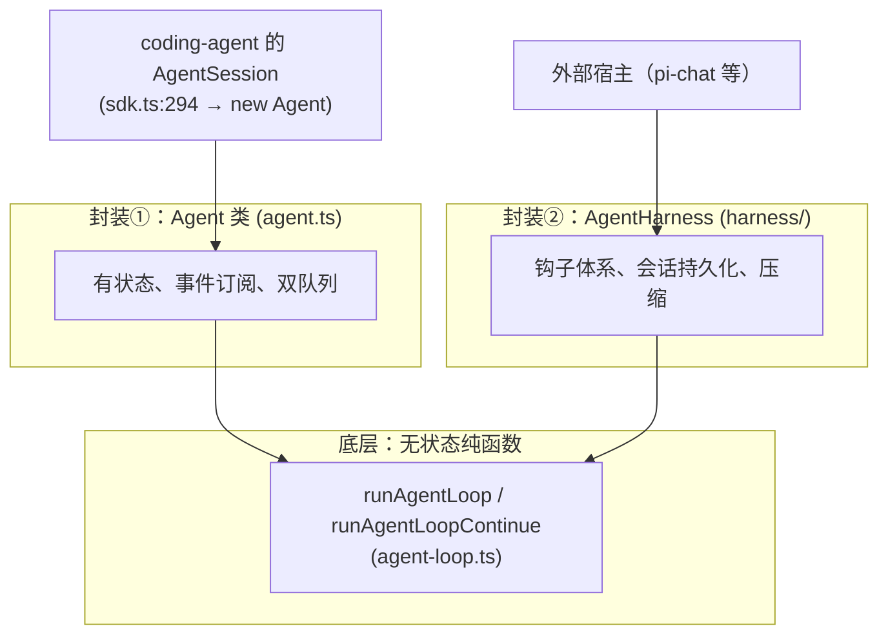
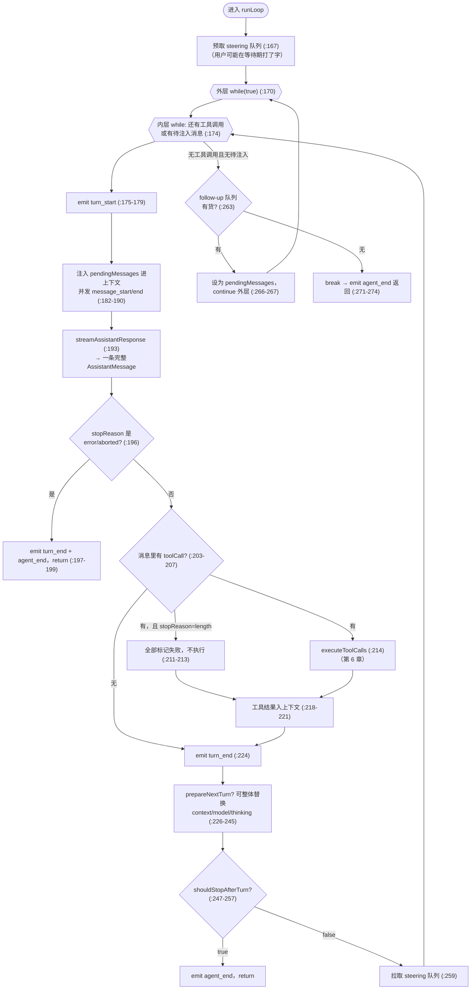
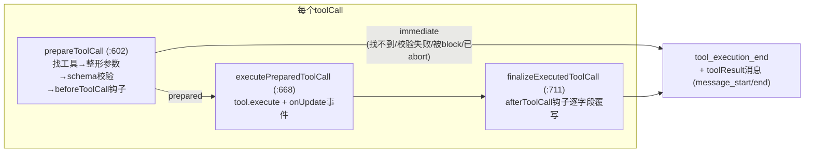

# 01 — packages/agent 深挖：Agent 运行时逐段走读

> 学习系列第 1 篇（全景地图见第 0 篇）。本篇精读 `packages/agent`（约 8,300 行，25 个文件）——五个包里最小、概念密度最高的一个。目标是读完后你能凭记忆画出 agent 循环的完整控制流，并说清每个回调钩子的触发时机与契约。
>
> 所有 `文件:行号` 基于 commit `3f9aa5d1`。除特别注明外，路径相对 `packages/agent/src/`。引用的 pi-ai 文件会写全路径。

## 目录

- 第 1 章 地形图：三层结构与两套平行封装
- 第 2 章 类型层（types.ts）：契约先行的设计
- 第 3 章 EventStream：88 行的推拉转换桥
- 第 4 章 agent-loop.ts（上）：runLoop 双层循环逐段走读
- 第 5 章 agent-loop.ts（中）：streamAssistantResponse 与流式增量
- 第 6 章 agent-loop.ts（下）：工具执行管道的三阶段
- 第 7 章 Agent 类：状态机、队列与生命周期
- 第 8 章 harness（上）：Session——树上的上下文构建
- 第 9 章 harness（中）：AgentHarness——钩子驱动的回合机
- 第 10 章 harness（下）：压缩算法
- 第 11 章 不变量、判断与坑

---

## 第 1 章 地形图：三层结构与两套平行封装

### 1.1 文件清单（按行数）

```
harness/agent-harness.ts   1029   高层封装②：钩子驱动的回合机
harness/types.ts            838   harness 层类型
agent-loop.ts               790   ★ 核心：无状态的 agent 循环
harness/compaction/*        ~1160  压缩与分支摘要
agent.ts                    575   高层封装①：有状态 Agent 类
harness/env/nodejs.ts       569   文件系统/进程抽象的 Node 实现
types.ts                    428   ★ 核心类型与回调契约
harness/skills.ts           375   skills 加载与格式化
proxy.ts                    367   跨进程 Agent 代理（本篇不展开）
harness/session/*           ~1070  会话树存储（JSONL/内存两种）
harness/prompt-templates.ts 267   /命令 模板展开
harness/messages.ts         164   ★ 自定义消息 + convertToLlm 参考实现
```

★ 是本篇的精读重点。另外 `packages/ai/src/utils/event-stream.ts`（88 行）虽然物理上在 ai 包，逻辑上是 agent 循环的血管，放在第 3 章讲。

### 1.2 关键架构事实：两套上层封装是平行的，不是叠加的

读这个包最容易误判的一点：`Agent` 类和 `AgentHarness` 不是"一个包着另一个"，而是**同一个底层函数 `runAgentLoop` 的两个互不依赖的封装**：



验证：`agent-harness.ts:2` 只 import `runAgentLoop`，全文没有 `new Agent(`；而 coding-agent 在 `packages/coding-agent/src/core/sdk.ts:294` 实例化的是 `Agent`。也就是说 **pi CLI 本身不经过 AgentHarness**——AgentHarness 是给非 CLI 宿主准备的"会话+压缩+钩子"一体化方案（`docs/agent-harness.md`、`docs/durable-harness.md` 是它的文档）。coding-agent 在 `Agent` 之上用自己的 `AgentSession`（第 0 篇 6.1 节）重新实现了一遍会话持久化和钩子——连压缩也是各自一套：agent-session.ts:44-54 import 的 `compact`、`prepareCompaction` 来自 coding-agent 自己的 `core/compaction/`（基于 SessionEntry 树），harness 的 `harness/compaction/` 是把它提炼成"基于消息数组"的可移植版，两边平行存在、互不引用（第 3 篇 03-coding-agent-core.md 更正并展开了这一点）。

**判断**：这是演化的痕迹而非精心设计——AgentSession 先于 AgentHarness 存在，后者是把前者的模式提炼成可复用组件的产物，且提炼尚未回头替换前者。读代码时两边会看到大量似曾相识的逻辑（队列、flush、事件转发），不要以为是你记错了。

### 1.3 分层原则在包内的延续

第 0 篇讲过包间的"无知分层"，包内同样如此：

- `agent-loop.ts` 不持有任何状态——上下文、配置全部由参数传入，输出只有事件和返回的消息数组。可以对它做纯函数式的推理。
- `agent.ts` 只加状态和队列，不知道会话文件的存在。
- `harness/` 才引入持久化、资源（skills/模板）、压缩。

---

## 第 2 章 类型层（types.ts）：契约先行的设计

types.ts（428 行）值得先读，因为它把整个运行时的行为契约写成了文档级注释。抓五个核心。

### 2.1 StreamFn：错误必须走事件流，不许 throw

```typescript
// types.ts:27-31
export type StreamFn = (
    model: Model<Api>,
    context: Context,
    options?: SimpleStreamOptions,
) => AssistantMessageEventStream | Promise<AssistantMessageEventStream>;
```

注释里的契约（types.ts:21-25）是理解整个错误处理体系的钥匙：**StreamFn 对请求/模型/运行时失败不得 throw、不得返回 rejected promise**；失败必须编码进返回的流里——以一条 `stopReason: "error"`（或 `"aborted"`）+ `errorMessage` 的最终 AssistantMessage 结尾。

这个决定的连锁效应：错误在类型上就是一条普通的助手消息，于是它能进会话历史、能被 UI 当消息渲染、能被重试逻辑检查（`isRetryableAssistantError`），整条链路不需要 try/catch 的旁路。第 4 章会看到 runLoop 对 error/aborted 的处理只有四行（agent-loop.ts:196-200）。

测试用的 faux provider、扩展自定义的 provider，都必须遵守这条契约。

### 2.2 AgentLoopConfig：九个回调，个个写明"must not throw"

AgentLoopConfig（types.ts:140-282）是传给循环的配置对象，除 `model` 外全是回调。逐个过一遍触发时机（第 4~6 章会看到每个的调用点）：

| 回调 | 触发时机 | 能做什么 |
|---|---|---|
| `convertToLlm`（必填，169 行） | 每次 LLM 调用前 | AgentMessage[] → Message[]，过滤/转换非 LLM 消息 |
| `transformContext`（191 行） | convertToLlm 之前 | AgentMessage 级裁剪/注入（压缩就挂在这） |
| `getApiKey`（201 行） | 每次 LLM 调用前 | 动态取 key（应对 OAuth 令牌过期，注释点名 GitHub Copilot） |
| `beforeToolCall`（267 行） | 参数校验后、执行前 | 返回 `{block: true}` 否决本次调用 |
| `afterToolCall`（281 行） | 执行后、事件发出前 | 逐字段覆写工具结果（无深合并，types.ts:66-76 写明语义） |
| `prepareNextTurn`（220-222 行） | turn_end 之后 | 替换下一轮的 context/model/thinkingLevel（中途换模型的实现点） |
| `shouldStopAfterTurn`（213 行） | prepareNextTurn 之后 | 返回 true 则优雅停机，不再发起下一次 LLM 调用 |
| `getSteeringMessages`（235 行） | 每个 turn 结束后 | 返回待注入的插话消息 |
| `getFollowUpMessages`（248 行） | agent 即将停止时 | 返回排队的后续消息，非空则再来一轮 |

注意几乎每个注释都带同一句话："Contract: must not throw or reject."（如 types.ts:150-151、199、211、233）。原因在注释里也写了：回调 throw 会打断底层循环、破坏事件序列的完整性。**这是回调式 API 的教科书做法：把异常处理的责任压给回调提供方，换取核心循环的简单。**

### 2.3 AgentMessage 与 declaration merging

```typescript
// types.ts:305-314
export interface CustomAgentMessages {
    // Empty by default - apps extend via declaration merging
}
export type AgentMessage = Message | CustomAgentMessages[keyof CustomAgentMessages];
```

`CustomAgentMessages[keyof CustomAgentMessages]` 读作"这个 interface 所有属性值类型的联合"。默认 interface 为空，联合就只剩 `Message`（user/assistant/toolResult）。任何宿主可以通过 declaration merging 往里加成员——harness 自己就是第一个用户（messages.ts:54-61）：

```typescript
declare module "../types.ts" {
    interface CustomAgentMessages {
        bashExecution: BashExecutionMessage;
        custom: CustomMessage;
        branchSummary: BranchSummaryMessage;
        compactionSummary: CompactionSummaryMessage;
    }
}
```

这四行执行后，全项目范围内 `AgentMessage` 的类型自动扩为 7 种 role 的联合。**内核不知道这些类型存在，但类型检查覆盖它们**——这就是第 0 篇 5.1 节说"这一个设计决定了整个系统的可扩展性"的具体机制。

### 2.4 AgentTool：execute 的签名藏着流式更新

```typescript
// types.ts:371-394（节选）
export interface AgentTool<TParameters extends TSchema = TSchema, TDetails = any> extends Tool<TParameters> {
    label: string;
    prepareArguments?: (args: unknown) => Static<TParameters>;
    execute: (
        toolCallId: string,
        params: Static<TParameters>,
        signal?: AbortSignal,
        onUpdate?: AgentToolUpdateCallback<TDetails>,
    ) => Promise<AgentToolResult<TDetails>>;
    executionMode?: ToolExecutionMode;
}
```

四个细节：

1. `Static<TParameters>`：typebox 的类型运算，从 JSON Schema 推导出参数的 TS 类型——schema 既是运行时校验器又是编译期类型，一份定义两用。
2. `onUpdate` 回调让长时间运行的工具（bash）流式上报部分结果，对应 `tool_execution_update` 事件。
3. `prepareArguments`（378 行）是给"模型发来的参数不太规范"留的整形垫片，跑在 schema 校验之前。
4. `executionMode`（393 行）允许单个工具声明"我必须串行"——第 6 章会看到它如何影响整批调用。

工具结果 `AgentToolResult`（350-360 行）里的 `terminate` 是个精巧的停机协议：**仅当一批工具结果全部 terminate=true 时才提前终止**（第 6 章）。

### 2.5 AgentEvent：九种事件

types.ts:413-428 定义全部九种事件，与第 0 篇 3.2 节的序列图对应。注意注释里的时序保证（406-411 行）：`agent_end` 是最后一个事件，但 **agent 要等所有 `agent_end` 监听器 settle 后才算 idle**——这个"事件发完 ≠ 跑完"的区分在第 7 章 Agent 类里有具体实现。

---

## 第 3 章 EventStream：88 行的推拉转换桥

位置：`packages/ai/src/utils/event-stream.ts`。这是全项目复用度最高的小组件，把"生产者推事件"和"消费者 for await 拉事件"接在一起，顺带提供"只要最终结果"的快捷通道。

### 3.1 双缓冲设计

```typescript
// event-stream.ts:4-11（节选）
export class EventStream<T, R = T> implements AsyncIterable<T> {
    private queue: T[] = [];                                        // 消费者没跟上时，事件排这
    private waiting: ((value: IteratorResult<T>) => void)[] = [];   // 消费者等着没事件时，resolve 排这
    private done = false;
    private finalResultPromise: Promise<R>;
```

`queue` 和 `waiting` 永远至多一个非空——生产快了堆 queue，消费快了堆 waiting。`push`（21-36 行）先看有没有等待中的消费者，有就直接喂，没有就入队：

```typescript
push(event: T): void {
    if (this.done) return;
    if (this.isComplete(event)) {                    // 构造时注入的"完成判定"
        this.done = true;
        this.resolveFinalResult(this.extractResult(event));
    }
    const waiter = this.waiting.shift();
    if (waiter) waiter({ value: event, done: false });
    else this.queue.push(event);
}
```

消费侧是一个 generator（50-62 行）：queue 有货就 yield，没货且 done 就返回，否则挂一个 promise 进 waiting 等下一次 push。

### 3.2 一份流，两种消费方式

构造函数注入 `isComplete` 和 `extractResult` 两个函数，使同一个流同时支持：

```typescript
for await (const event of stream) { ... }    // 方式一：逐事件消费（UI 渲染用）
const message = await stream.result();       // 方式二：只要最终结果（print 模式、compact 用）
```

`AssistantMessageEventStream`（69-83 行）是它的具体化：`done` 或 `error` 事件算完成，最终结果就是完整的 AssistantMessage。**注意 error 事件的 result 也正常 resolve（不 reject）**——again，错误是数据不是异常（2.1 节的契约在这里落地）。

agent-loop 自己也用泛型版包装循环输出（agent-loop.ts:145-150）：`agent_end` 算完成、其 `messages` 字段是最终结果。所以 `agentLoop()` 的返回值也是一个可以 for await 或 await result() 的流。

---

## 第 4 章 agent-loop.ts（上）：runLoop 双层循环逐段走读

文件头注释一句话点题（agent-loop.ts:1-4）："Agent loop that works with AgentMessage throughout. Transforms to Message[] only at the LLM call boundary."

### 4.1 两个入口的差异

```typescript
agentLoop(prompts, context, config, signal?, streamFn?)          // :31 带新消息启动
agentLoopContinue(context, config, signal?, streamFn?)           // :64 从现有上下文续跑
```

`agentLoopContinue` 有两道运行时守卫（70-76 行）：上下文不能为空、最后一条不能是 assistant。注释（56-62 行）还写了一条**无法在此校验**的约束：最后一条消息经 `convertToLlm` 转换后必须是 `user` 或 `toolResult`——因为 convertToLlm 每轮只调一次，入口处没法预演。违反的后果是 provider 直接拒绝请求。这是"续跑"（重试场景）的调用方必须自己保证的前置条件。

两个入口最终都进 `runLoop`，差别只在启动时是否注入 prompts 并为它们发 message_start/end 事件（runAgentLoop 109-114 行 vs runAgentLoopContinue 138-139 行）。

### 4.2 runLoop 主体：双层循环

完整控制流（agent-loop.ts:155-275），值得画成图记住：



五个值得咀嚼的点：

**① 内层循环条件是"或"**（174 行）：`hasMoreToolCalls || pendingMessages.length > 0`。即使助手没再调工具，只要 steering 队列里有消息，循环也继续——插话不是"打断重来"而是"顺势追加"，助手当前 turn 的工具照常执行完（types.ts:229 注释明确"Tool calls from the current assistant message are not skipped"）。

**② steering 的三个采样点**：进入循环前（167 行，"user may have typed while waiting"）、每个 turn 结束后（259 行）。没有第三个——工具执行**中途**不采样，插话最早也要等本 turn 的工具批跑完。

**③ length 截断防御**（207-214 行）：`stopReason === "length"` 时整批工具调用不执行、全部替换为错误结果。为什么这么狠？`failToolCallsFromTruncatedMessage` 的注释（376-382 行）解释了根因：流式工具调用参数用**尽力而为的 JSON 补救解析器**收尾，所以截断的参数可能"能解析、能过校验，但内容悄悄不完整"——校验挡不住，只能全杀。错误结果的文本明确指示模型重发（398 行）。这是从生产事故里学来的防御，自己做 agent 循环时直接抄。

**④ prepareNextTurn 是热切换点**（226-245 行）：turn 之间可以整体替换 context、model、thinking level。第 9 章会看到 AgentHarness 用它实现"每 turn 从会话重建状态"，coding-agent 用它实现循环中途换模型。注意 thinkingLevel 到 config.reasoning 的翻译（238-243 行）："off" 映射为 undefined。

**⑤ follow-up 与 steering 的本质区别**就在循环层级：steering 在内层每 turn 采样（agent 干活时插话），follow-up 只在 agent "本来要停"时采样（263-268 行，排队等它干完）。同一个消息走哪个队列，语义完全不同。

---

## 第 5 章 agent-loop.ts（中）：streamAssistantResponse 与流式增量

这个函数（281-374 行）是 AgentMessage 世界与 LLM 世界的唯一关口。

### 5.1 调用前：三步准备

```typescript
// agent-loop.ts:288-314（节选）
let messages = context.messages;
if (config.transformContext) {
    messages = await config.transformContext(messages, signal);     // ① AgentMessage → AgentMessage
}
const llmMessages = await config.convertToLlm(messages);             // ② AgentMessage → Message
const llmContext: Context = { systemPrompt: context.systemPrompt, messages: llmMessages, tools: context.tools };
const streamFunction = streamFn || streamSimple;                     // ③ 默认直连 pi-ai
const resolvedApiKey = (config.getApiKey ? await config.getApiKey(config.model.provider) : undefined) || config.apiKey;
const response = await streamFunction(config.model, llmContext, { ...config, apiKey: resolvedApiKey, signal });
```

管道顺序是硬编码的：transformContext 永远在 convertToLlm 之前。两阶段的分工（types.ts 注释）：前者做 AgentMessage 级操作（裁剪、注入），后者做角色转换与过滤。API key 每次调用现取（306-308 行）——为的是长工具执行期间令牌可能过期。

### 5.2 调用中：partial 消息的原地替换

流式消费循环（319-346 行）维护一个不变量：**上下文的最后一条消息始终是"到目前为止的部分助手消息"**。

- `start` 事件：把 partial 推进 `context.messages`，发 message_start（321-326 行）。
- 九种增量事件（text/thinking/toolcall 的 start/delta/end）：用新 partial **替换数组最后一项**（339 行 `context.messages[context.messages.length - 1] = partialMessage`），发 message_update——事件里同时带完整 partial 和原始增量事件（340-344 行），UI 可以选择全量重绘或增量追加。
- `done`/`error`：用 `response.result()` 拿最终消息替换 partial，发 message_end（348-361 行）。

有一个防御分支容易看漏：如果流没发 `start` 就直接结束（`addedPartial === false`，356-358 行和 365-371 行），最终消息会补一对 message_start/message_end——保证下游永远看到成对的事件。**事件序列的完整性优先于一切**，这是全文件反复出现的原则。

### 5.3 每个 message_update 都被 await

注意 emit 是 `await` 的（agent-loop.ts 全文），而 Agent 类的 processEvents 又会 await 每个订阅者（第 7 章）。也就是说**一个慢的事件监听器会反压整个流式渲染**。这是刻意选择：保证监听器看到的事件严格有序、且 agent_end 时所有副作用（如会话落盘）已完成。代价是监听器必须自律地快。

---

## 第 6 章 agent-loop.ts（下）：工具执行管道的三阶段

工具执行占了文件后半（383-790 行），核心是一条三阶段管道，串行/并行两种模式共享其中两段。

### 6.1 管道总览



`prepareToolCall`（602-666 行）返回可辨识联合：`{kind:"prepared"}` 或 `{kind:"immediate"}`。immediate 表示不用执行就有结果——工具不存在（610-615 行）、参数校验抛错（659-665 行，catch 转错误结果）、`beforeToolCall` 返回 block（638-644 行）、信号已中止（631-651 行两处检查）。**所有失败路径都汇成"错误工具结果"而非异常**——模型能看到失败原因并自行修正，循环不中断。

`executePreparedToolCall`（668-709 行）有个精细的收尾：`onUpdate` 产生的 `tool_execution_update` 事件被收进 promise 数组，工具结束后 `acceptingUpdates = false` 截止新事件、`await Promise.all(updateEvents)` 等已发事件全部送达（696-697 行）——保证 update 事件不会晚于 end 事件到达监听器。types.ts:363-367 的注释与之呼应："Calls made after the tool promise settles are ignored."

`finalizeExecutedToolCall`（711-754 行）应用 `afterToolCall` 的逐字段覆写（735-742 行，`??` 保底原值）；钩子自己 throw 则整个结果变错误（743-746 行）——harness 的 tool_result 扩展钩子就挂在这。

### 6.2 串行 vs 并行：并行只并行"执行"段

模式选择（413-428 行）：config 指定 sequential，**或批中任意一个工具声明 `executionMode: "sequential"`**，整批就走串行（421-424 行）。文件写入类工具靠这个避免并发踩踏。

并行版（491-556 行）的结构值得细看，它其实是"顺序预检 + 并发执行 + 按源序出结果"：

1. **预检永远是顺序的**：for 循环逐个 `prepareToolCall`（501-509 行）——beforeToolCall 钩子（权限确认对话框！）不能并发弹出。
2. immediate 结果当场收进数组；prepared 的则包成 **thunk**（`async () => {...}`，524-536 行）压进数组，此时还没执行。
3. `Promise.all` 把所有 thunk 同时启动（542-544 行）——并发发生在这一刻。`tool_execution_end` 在各工具完成时乱序发出（thunk 内部 534 行）。
4. 但 **toolResult 消息严格按助手消息里的源顺序发出**（545-550 行）：Promise.all 的返回值保持数组序，再逐个 createToolResultMessage + emit。

types.ts:37-40 的注释精确描述了这个双时序："`tool_execution_end` is emitted in tool completion order …, while tool-result message artifacts are emitted later in assistant source order."——UI 进度按完成序刷新，而进入上下文/会话的消息序是确定性的。**一次执行，两种顺序，各取所需。**

### 6.3 terminate：全票才停

```typescript
// agent-loop.ts:584-586
function shouldTerminateToolBatch(finalizedCalls: FinalizedToolCallOutcome[]): boolean {
    return finalizedCalls.length > 0 && finalizedCalls.every((finalized) => finalized.result.terminate === true);
}
```

`every` 而不是 `some`：一批调用里只要有一个工具不要求终止，循环就继续。structured-output 这类"终结型工具"（第 0 篇 11.3 节）依赖这个语义——模型单独调用它时全票通过、立即停机；混在其他工具里调用则不会误停。

### 6.4 toolResult 也是消息

每个工具结果最终以 `role: "toolResult"` 消息进入上下文，并发一对 message_start/message_end（787-790 行）。`createToolResultMessage`（773-785 行）里有个防御注释值得记：JS 扩展（无类型）可能返回没有 content 的结果，`content ?? []` 归一化，"so the null never enters session history or provider payloads"——边界上的脏数据在入口处清洗。

---

## 第 7 章 Agent 类：状态机、队列与生命周期

agent.ts（575 行）把无状态循环包成一个可长期持有的对象。

### 7.1 状态：防御性复制无处不在

`createMutableAgentState`（67-94 行）用闭包 + getter/setter 实现两条规则：赋值 `state.tools`/`state.messages` 时复制传入数组（80-88 行），读取时返回内部引用。加上 `createContextSnapshot`（424-430 行）在每次启动循环时再 `.slice()` 一份——**Agent 的状态数组和循环正在改的数组永远不是同一个对象**。循环跑完后新消息通过事件（message_end → processEvents 539 行 push）回写状态，而不是共享引用。

`DEFAULT_MODEL`（47-58 行）是个全零占位模型（id "unknown"）——允许先建 Agent 后设模型，代价是运行时才会发现没配模型。配套的 `EMPTY_USAGE`（38-45 行）用于合成失败消息。

### 7.2 PendingMessageQueue：12 行核心逻辑撑起两种排队语义

```typescript
// agent.ts:139-152
drain(): AgentMessage[] {
    if (this.mode === "all") {
        const drained = this.messages.slice();
        this.messages = [];
        return drained;
    }
    const first = this.messages[0];
    if (!first) return [];
    this.messages = this.messages.slice(1);
    return [first];
}
```

`QueueMode`（types.ts:49）的两种排空策略："all" 一次全注入；"one-at-a-time" 每个采样点只放一条——用户连发三条插话，agent 会一条一条地消化，每条之间都有完整的思考-工具循环。默认都是 one-at-a-time（agent.ts:222-223）。Agent 持有两个队列实例：steeringQueue 和 followUpQueue（174-175 行），接进 loopConfig 的两个 getter（458-465 行）。

### 7.3 prompt / continue 的入口语义

`prompt()`（335-345 行）有三种重载（纯文本+图片 / 单消息 / 消息数组），忙时直接 throw 并提示用 steer/followUp（338-342 行）——**一个 Agent 同时只有一个 run**，这是硬约束。

`continue()`（348-375 行）比表面复杂，它处理三种恢复场景：

1. 最后一条是 user/toolResult → 走 `runAgentLoopContinue`（374 行），标准重试路径。
2. 最后一条是 assistant 且 steering 队列有货 → 把队列消息当新 prompt 启动，**且带 `skipInitialSteeringPoll: true`**（358-363 行）。
3. 最后一条是 assistant 且 follow-up 队列有货 → 同上但不跳过（365-368 行）。

场景 2 的 skip 标志是个精细的防重复：消息已经从队列 drain 出来当 prompt 了，而 runLoop 入口还会再 poll 一次 steering（agent-loop.ts:167）——不跳过的话，如果队列在这间隙又进了消息倒无妨，但 drain 出来的这批会与入口 poll 语义重叠。实现上是个一次性闭包开关（createLoopConfig 433/459-463 行）：第一次 poll 返回空并翻转标志，之后恢复正常。

### 7.4 runWithLifecycle：run 的原子性

```typescript
// agent.ts:469-492（骨架）
private async runWithLifecycle(executor: (signal: AbortSignal) => Promise<void>): Promise<void> {
    if (this.activeRun) throw new Error("Agent is already processing.");
    const abortController = new AbortController();
    const promise = new Promise<void>((resolve) => { resolvePromise = resolve; });
    this.activeRun = { promise, resolve: resolvePromise, abortController };
    this._state.isStreaming = true;
    try {
        await executor(abortController.signal);
    } catch (error) {
        await this.handleRunFailure(error, abortController.signal.aborted);
    } finally {
        this.finishRun();          // isStreaming=false, pendingToolCalls清空, resolve promise
    }
}
```

`activeRun` 同时承担四件事：互斥锁（470 行）、abort 通道（`abort()` 310-312 行）、idle 等待（`waitForIdle()` 319-321 行返回其 promise）、信号分发（`signal` getter 305-307 行）。

`handleRunFailure`（494-510 行）是 2.1 节契约的最后防线：万一循环还是抛了（比如 convertToLlm 违约），合成一条 `stopReason: "error"` 的助手消息，并**手工补发完整的事件四连**（message_start/end、turn_end、agent_end）——订阅者永远看到合法的事件序列收尾，UI 不会挂在"转圈"状态。

### 7.5 processEvents：先 reduce 后广播

每个循环事件进 `processEvents`（527-574 行）：先按事件类型更新内部状态（streamingMessage、messages、pendingToolCalls、errorMessage），再 **按订阅顺序逐个 await 监听器**（571-573 行）。两个细节：

- pendingToolCalls 的更新是"复制 Set 再改"（543-545、550-552 行）——即使内部状态也遵守不可变风格，读取方拿到的 ReadonlySet 不会被后续事件原地改动。
- 监听器在无活跃 run 时被调用会直接 throw（568-570 行）——捕获"事件泄漏到 run 外"的编程错误。

结合 2.5 节的时序保证：`agent_end` 发出后还要等监听器 settle、finishRun 执行，`isStreaming` 才翻 false（types.ts:336-339 注释、agent.ts:520-526 注释都强调了这一点）。**判断 agent 是否空闲要用 `waitForIdle()`，不要自己监听 agent_end**——这是下游（AgentSession、扩展）容易踩的坑，注释里写了三遍。

---

## 第 8 章 harness（上）：Session——树上的上下文构建

harness/session/ 把"会话是一棵树"落成代码。第 0 篇 6.3 节看的是 coding-agent 的 SessionManager，这里是它的底层参考实现（两者共享条目模型）。

### 8.1 append 语义：leaf 指针驱动的树生长

Session 类（session.ts:137-338）所有 append 方法长得一样：

```typescript
// session.ts:203-211
async appendMessage(message: AgentMessage): Promise<string> {
    return this.appendTypedEntry({
        type: "message",
        id: await this.storage.createEntryId(),
        parentId: await this.storage.getLeafId(),    // ← 新条目挂在当前 leaf 下
        timestamp: new Date().toISOString(),
        message,
    } satisfies MessageEntry);
}
```

树的生长规则就一条：**新条目的 parentId 是当前 leaf，追加后 leaf 移到新条目**。分支导航 `moveTo(entryId)`（318-337 行）只是把 leaf 指针挪到任意历史条目——之后的 append 自然长出新分支，旧分支原样留在文件里。moveTo 可选带一条 branch_summary（327-336 行）：对被离开的分支生成摘要挂在新位置，让模型"记得"那条路发生过什么。

存储层两个实现：JSONL（jsonl-storage.ts，append-only 文件，v3 header）和内存（memory-storage.ts，`--no-session` 用）。短 ID 生成取 uuidv7 的**末尾** 8 位（jsonl-storage.ts:36-44）——前缀是时间戳派生的，相邻调用几乎相同，随机性全在尾部。

### 8.2 buildContext：从"当前分支"重建 LLM 上下文

上下文构建是纯函数管道（session.ts:125-135）：

```
getBranch()                     leaf 沿 parentId 回溯到根，得到当前分支的条目序列 (:166-169)
  → deriveSessionContextState   扫描分支还原状态：thinkingLevel/model/activeTools (:37-55)
  → defaultContextEntryTransform 压缩替换（下述）(:57-80)
  → 自定义 entryTransforms       宿主追加的变换
  → sessionEntryToContextMessages 条目 → AgentMessage (:93-123)
```

`defaultContextEntryTransform` 是压缩生效的机制（57-80 行）：找**最后一条** compaction 条目，输出 = [该 compaction] + [firstKeptEntryId 起的保留段] + [compaction 之后的全部条目]。压缩前的历史直接消失，被摘要条目顶替。多次压缩只认最后一次——因为每次压缩的摘要本身就吸收了上一次的（第 10 章 UPDATE prompt）。

`deriveSessionContextState` 里有个容易漏看的细节（47-48 行）：模型状态不仅来自显式的 model_change 条目，**每条 assistant 消息自带的 provider/model 也会推进它**——恢复会话时"接着用上次实际用的模型"靠这个。

条目到消息的映射（93-123 行）：`message` 直出；`compaction`/`branch_summary` 变成对应的摘要消息；`custom_message` 变 CustomMessage；`custom` 默认**不进上下文**，除非宿主注册了对应 customType 的 projector（119-121 行）——这就是第 0 篇 6.3 节"custom 与 custom_message 之分"在类型系统之外的执行机制。

### 8.3 convertToLlm 参考实现：一切皆 user

messages.ts:120-164 是 harness 版 convertToLlm，回答"自定义消息最终怎么见 LLM"：

| AgentMessage role | 转换结果 |
|---|---|
| `bashExecution` | user 消息，内容是 `` Ran `cmd` ``+代码块输出（63-79 行格式化；`excludeFromContext` 则丢弃） |
| `custom` | user 消息，内容原样 |
| `branchSummary` | user 消息，套 `<summary>` 标签 + 固定前言（12-17 行） |
| `compactionSummary` | user 消息，套 `<summary>` 标签 + "历史已压缩"前言（4-10 行） |
| user/assistant/toolResult | 原样通过 |
| 其他 | 丢弃 |

全部翻译成 **user** 角色——对 LLM 而言，压缩摘要、bash 输出都是"用户告诉我的事"。简单、通用，且对任何 provider 都合法。

---

## 第 9 章 harness（中）：AgentHarness——钩子驱动的回合机

agent-harness.ts（1029 行）是包里最大的文件。它对 runAgentLoop 的包装比 Agent 类厚得多：加了会话持久化、资源（skills/模板）、钩子事件总线、以及一个显式的 phase 状态机。

### 9.1 phase 状态机与三个队列

```typescript
// agent-harness.ts:165, 176-180
private phase: AgentHarnessPhase = "idle";          // idle | turn | compaction | ...
private steerQueue: UserMessage[] = [];
private followUpQueue: UserMessage[] = [];
private nextTurnQueue: AgentMessage[] = [];
```

与 Agent 类的两队列相比多了 `nextTurnQueue`：steer/followUp 都要求"正忙"（657-667 行，idle 时调用直接 throw），而 `nextTurn()`（669-672 行）任何时候都能调——消息存着，**下一次 prompt 启动时**批量前置注入（executeTurn 538-547 行）。三种投递语义对应扩展 API `sendMessage` 的 `deliverAs: "steer" | "followUp" | "nextTurn"`（第 0 篇 9.2 节），源头在这。

所有入口（prompt/skill/promptFromTemplate，608-655 行）模式一致：非 idle 即 throw busy → phase 置 turn → 建 turnState → executeTurn → finally 恢复。skill 和模板入口只是把调用格式化成文本再走同一条路（631、648 行）。

### 9.2 pendingSessionWrites：为什么写会话要排队

Agent 类没有的新问题：宿主在 agent 跑的过程中调 `appendMessage` 等修改会话的 API，直接写会破坏"会话条目序 = 事件序"的对应关系。解法（674-684 行）：idle 时直写，忙时压进 `pendingSessionWrites`，在三个固定点 flush（462-486 行的逐类型分发）：

- **turn_end 事件时**（handleAgentEvent 494-505 行）：flush 后额外发一个 harness 自有事件 `save_point`——告诉宿主"此刻会话文件是一致的"，durable-harness（进程崩溃恢复）的锚点。
- **prepareNextTurn 时**（createLoopConfig 435-444 行）：flush 后**整个重建 turnState 并替换循环的 context/model/thinking**。这是 AgentHarness 最重要的一个设计：每个 turn 之间，宿主对模型、工具、系统提示词的任何修改都从会话真实状态重新推导生效——循环内的"热更新"不靠散落的 setter，靠统一的重建。
- **agent_end 时**（507-512 行）：flush、phase 归 idle、发 `settled` 事件（带 nextTurnQueue 长度，宿主可决定是否立刻再启动一轮）。

### 9.3 事件与钩子：AgentEvent 之上的第二层总线

AgentHarness 把底层 AgentEvent 原样转发给订阅者（emitAny，222-230 行），同时定义了一批**可返回值的钩子**（emitHook，232-249 行——多个 handler 依次执行，最后一个非 undefined 的返回值生效）。钩子怎么接进循环（createLoopConfig 399-448 行）一目了然：

| harness 钩子 | 挂载点 |
|---|---|
| `context` | loopConfig.transformContext（408-411 行） |
| `tool_call` | loopConfig.beforeToolCall（412-420 行） |
| `tool_result` | loopConfig.afterToolCall（421-434 行） |
| `before_agent_start` | executeTurn 里、循环启动前（548-555 行，可追加消息/换系统提示词） |
| `before_provider_request` | createStreamFn 内、每次 LLM 调用前（363 行，可打补丁 headers/timeout/重试参数，applyStreamOptionsPatch 82-122 行是一套显式的 patch 语义：`Object.hasOwn` 区分"没提这个字段"和"显式设为 undefined 以删除"） |
| `before_provider_payload` | streamSimple 的 onPayload（370 行，最后一刻改写 wire payload） |
| `after_provider_response` | streamSimple 的 onResponse（371-377 行，读状态码/响应头） |

对照第 0 篇 9.2 节 coding-agent 的 30+ 扩展事件：**AgentHarness 的钩子集是它的精简版**，两者同名事件语义一致。再次印证 1.2 节的判断——这是同一套模式的两次实现。

细节控可看 `drainQueuedMessages`（387-397 行）：drain 后先发 queue_update 事件，**事件处理器 throw 则把消息 unshift 回队列再抛**——连"通知失败"都不弄丢用户消息。

---

## 第 10 章 harness（下）：压缩算法

compaction/compaction.ts（753 行）回答三个问题：什么时候压、从哪里切、摘要怎么生成。

### 10.1 什么时候压：基于 provider 真实用量

```typescript
// compaction.ts:200-203
export function shouldCompact(contextTokens: number, contextWindow: number, settings: CompactionSettings): boolean {
    if (!settings.enabled) return false;
    return contextTokens > contextWindow - settings.reserveTokens;
}
```

阈值 = 模型上下文窗口 − reserveTokens（默认 16384，DEFAULT_COMPACTION_SETTINGS 111-115 行）。contextTokens 的估算（estimateContextTokens 169-197 行）是"锚点 + 增量"式的：找最后一条**有效**助手消息的 provider usage 当锚（aborted/error 的不算，getAssistantUsage 121-134 行），锚之后的消息用启发式补估。启发式（estimateTokens 224-264 行）简单粗暴：字符数 ÷ 4，图片按 4800 字符计（205 行 `ESTIMATED_IMAGE_CHARS`）。**判断**：÷4 对英文合理、对中文明显低估（中文一字一到两 token），但锚点机制保证误差只作用于最近几条消息，可接受。

### 10.2 从哪里切：cut point 算法

目标：留下约 keepRecentTokens（默认 20000）的近期消息，其余压掉。`findCutPoint`（333-381 行）：

1. `findValidCutPoints`（265-303 行）枚举合法切点——几乎所有消息条目都能当切点，**唯独 toolResult 不能**（281-282 行显式 break 不加入）：从工具结果处切开会造成"有 toolCall 没 toolResult"的孤儿，provider 会拒绝。
2. 从尾部向前累积 token（347-361 行），够 20000 时选择第一个不小于当前位置的切点。
3. 切点如果落在 turn 中间（比如助手连环工具调用的中途），`findTurnStartIndex`（306-320 行）向前找到本 turn 的起点（user/bashExecution 消息），标记 `isSplitTurn`（372-379 行）——后续摘要生成会对"被劈开的 turn"做特殊处理（turn 前半进摘要，后半保留）。

### 10.3 摘要怎么生成：结构化 checkpoint + 增量更新

摘要不是自由发挥，`SUMMARIZATION_PROMPT`（387-418 行）强制固定模板：Goal / Constraints & Preferences / Progress（Done/In Progress/Blocked）/ Key Decisions / Next Steps / Critical Context，并要求"Preserve exact file paths, function names, and error messages"。这是给**下一个 LLM** 读的交接文档，不是给人读的。

再次压缩时用 `UPDATE_SUMMARIZATION_PROMPT`（420-457 行）：旧摘要放 `<previous-summary>` 标签里，新消息增量合并进去（规则：保留既有信息、Done 项累积、In Progress 状态推进）——这解释了 8.2 节"上下文只认最后一条 compaction"为什么成立。

生成调用（generateSummary 460-519 行）细节：maxTokens = `0.8 × reserveTokens`（470-473 行，给提示词本身留 20% 余量）；对话正文序列化后套 `<conversation>` 标签；aborted/error 分别转成带错误码的 CompactionError（504-514 行）——压缩失败不静默，宿主能区分"用户取消"和"真失败"。

另外压缩会顺手提取**文件操作清单**（extractFileOperations 35-58 行）：从被压历史里收集读过/改过的文件路径存进 compaction 条目的 details，且累积上一次压缩的清单（41-52 行）——模型压缩后仍知道"这个会话动过哪些文件"，不用重新 read。这是 coding agent 特有的领域知识渗进了通用 harness，**判断**：放在这一层略显越界，但实用主义赢了。

---

## 第 11 章 不变量、判断与坑

读完全包后值得固化的结论。

### 11.1 系统不变量（改代码时不能破坏的）

1. **事件序列永远完整合法**：agent_start/turn_start 配对收尾，message_start/end 成对，toolResult 消息紧跟 tool_execution_end。三处防御专门为此存在：streamAssistantResponse 的 addedPartial 补发（5.2 节）、handleRunFailure 的合成四连（7.4 节）、工具 update 事件的截止排水（6.1 节）。
2. **错误是数据不是异常**：StreamFn 不许 throw，工具失败变错误结果，压缩失败变 Result 类型。整个包只有"编程错误"（busy 时调 prompt、事件泄漏到 run 外）才 throw。
3. **LLM 上下文的最后一条必须是 user/toolResult** 才能发起调用（agentLoopContinue 的守卫 + convertToLlm 的责任）。
4. **上下文数组与状态数组永不共享引用**（7.1 节的三层复制）。
5. **会话树 leaf 指针是唯一的写入位置**；toolResult 永远不能当压缩切点。

### 11.2 值得抄走的设计

- 可辨识联合 + "must not throw" 契约回调，换来核心循环不到 300 行且可纯函数推理。
- 并行工具的"顺序预检 + thunk 并发 + 源序出结果"三段式（6.2 节）——并发与确定性两全。
- terminate 的全票语义、length 截断的整批作废——两个从实战来的保守协议。
- 结构化压缩摘要 + 增量更新 prompt（10.3 节），可直接移植到任何长会话系统。

### 11.3 坑（下游开发者视角）

- **agent_end ≠ idle**：判断空闲用 `waitForIdle()`（7.5 节）。
- **事件监听器被同步 await**：慢监听器拖慢流式渲染（5.3 节）。
- **steering 采样只在 turn 边界**：长工具执行期间插话不会立即生效（4.2 节②）。
- **token 估算对 CJK 偏低**（10.1 节）：中文重度会话的自动压缩会偏晚触发。
- **AgentHarness 与 Agent 是平行实现**（1.2 节）：给 coding-agent 提 PR 时改的是 AgentSession/Agent 这条线，改 AgentHarness 不会影响 pi CLI 的行为；反之亦然。

### 11.4 与下一篇的接口

本篇止步于 `streamFn(model, llmContext, options)` 这一行（agent-loop.ts:310）。这个调用进入 pi-ai 后如何变成具体厂商的 HTTP 请求、SSE 增量如何组装成 AssistantMessageEvent，是 `02-ai.md` 的主线。

---

*基于 commit 3f9aa5d1。agent 包是五包中 API 最稳定的（AgentLoopConfig 的回调契约、AgentEvent 的九种事件构成对外承诺），行号可能漂移，但本篇描述的控制流与不变量短期内不会变。*
