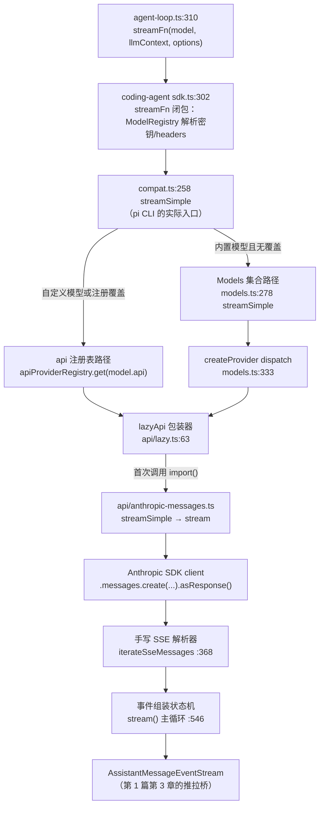
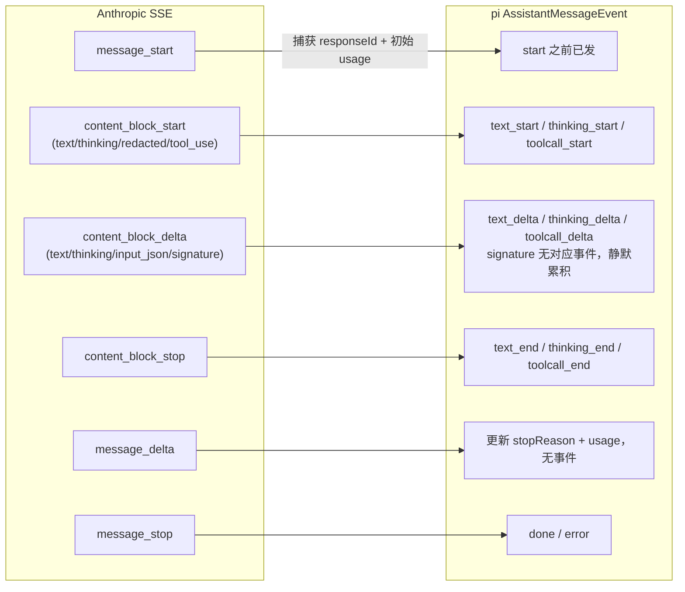

# 02 — packages/ai 深挖：从 streamSimple 到厂商 SSE 的完整链路

> 学习系列第 2 篇（全景地图见第 0 篇，agent 运行时见第 1 篇）。上一篇止步于 `streamFn(model, llmContext, options)` 这一行（packages/agent/src/agent-loop.ts:310）。本篇追踪这个调用进入 pi-ai 之后的全部旅程：模型如何路由到 API 实现、HTTP 请求如何构造、厂商的 SSE 字节流如何组装成第 1 篇里消费的 `AssistantMessageEvent`、密钥从哪里来。精读对象是 anthropic-messages 这条线；其余 8 个 API 实现结构同构，只在方言上不同。
>
> 所有 `文件:行号` 基于 commit `3f9aa5d1`。除特别注明外，路径相对 `packages/ai/src/`。

## 目录

- 第 1 章 地形图：三万六千行里要精读的只有六千行
- 第 2 章 双入口：index（新世界）与 compat（旧世界），pi CLI 走哪条
- 第 3 章 类型层（types.ts）：Api × Provider 二维坐标系
- 第 4 章 lazyStream / lazyApi：同步外壳、异步装配
- 第 5 章 models.ts：Provider 工厂与 Models 集合
- 第 6 章 streamSimple 的预算学（simple-options.ts）
- 第 7 章 anthropic-messages（上）：三种客户端与请求构造
- 第 8 章 anthropic-messages（中）：消息转换——跨模型重放的兼容层
- 第 9 章 anthropic-messages（下）：手写 SSE 解析与事件组装状态机
- 第 10 章 鉴权体系：CredentialStore、OAuth 流程与 env 解析
- 第 11 章 横切工具：溢出检测、重试分类、JSON 修复
- 第 12 章 faux provider：可编程假厂商
- 第 13 章 不变量、判断与坑

---

## 第 1 章 地形图：三万六千行里要精读的只有六千行

`packages/ai` 共约 36,000 行，是五个包里物理体积最大的，但其中约 21,000 行是**生成的模型目录**（`providers/*.models.ts`，最大的 openrouter.models.ts 一个文件 4,834 行）——纯数据，不用读。剩下的逻辑代码按职责分四层：

```
─ 目录层（生成的数据，不读）
  providers/*.models.ts        ~21,000  各厂商模型的价格/窗口/能力表
  models.generated.ts               76  汇总 34 个厂商目录为 MODELS 常量

─ API 实现层（方言翻译，精读一个）
  api/anthropic-messages.ts       1239  ★ 本篇精读
  api/openai-codex-responses.ts   1568  最复杂（WebSocket 传输）
  api/openai-completions.ts       1294  兼容面最广（detectCompat 见第 11 章）
  api/bedrock-converse-stream.ts  1081  AWS SigV4 签名
  其余 5 个 api/*.ts              ~2400

─ 装配层（路由与注册，全读，都很短）
  models.ts                        441  ★ Provider 工厂 + Models 集合
  compat.ts                        277  ★ 旧全局 API（pi CLI 现役入口）
  api/lazy.ts                       70  ★ 动态加载桥
  providers/<name>.ts            15×34  厂商定义（每个 15 行）
  providers/all.ts                 131  内置厂商清单

─ 鉴权与工具层（按需读）
  auth/*                          ~700  ★ 新鉴权抽象
  utils/oauth/*                  ~2000  各家 OAuth 流程实现
  env-api-keys.ts                  177  env 变量映射表
  utils/{retry,overflow}.ts        266  错误分类（第 11 章）
  providers/faux.ts                538  测试假厂商（第 12 章）
```

★ 是本篇的精读重点，合计约 6,000 行。**判断**：这个包完美印证第 0 篇的结论"复杂度在边缘"——引擎（装配层）不到 1,000 行，其余全是厂商方言的翻译成本。读懂 anthropic-messages 一条线后，其他 API 实现只需要看"方言差异"，不需要重新理解结构。

### 1.1 一次调用的全景路线

先把终点图挂出来，后面各章逐段放大：



---

## 第 2 章 双入口：index（新世界）与 compat（旧世界），pi CLI 走哪条

这个包最容易迷路的地方：它有**两套平行的对外 API**，对应两代设计。第 1 篇里 Agent/AgentHarness 的"演化痕迹"模式在这里重演了一遍。

### 2.1 index.ts：无副作用的新世界

`index.ts`（1-48 行）的头注释写得很清楚：**"Core only, side-effect free"**——不导出生成目录、不导出厂商工厂、不导出 api 注册表。新代码的用法是显式装配：

```typescript
import { createModels } from "@earendil-works/pi-ai";
import { builtinModels } from "@earendil-works/pi-ai/providers/all";

const models = builtinModels();           // 注册全部 34 个内置厂商
const stream = models.streamSimple(model, context, options);
```

`Models` 集合（第 5 章）负责厂商查找、鉴权解析、流转发。

### 2.2 compat.ts：会消失的旧世界，但今天 pi CLI 就跑在上面

`compat.ts`（1-11 行头注释）自称 "Temporary compatibility entrypoint … This module is deleted with the coding-agent ModelManager migration"。它保留旧的**全局 api 注册表**：一个模块级 `Map<Api, ApiProvider>`（compat.ts:94），按 `model.api` 字符串分发，模块加载时自动注册 9 个内置 API（compat.ts:206 顶层调用 `registerBuiltInApiProviders()`——这就是它"有副作用"的意思）。

关键事实：**coding-agent 和 agent 包今天都从 compat 导入**——

- `packages/coding-agent/src/core/sdk.ts:3`：`import { … streamSimple } from "@earendil-works/pi-ai/compat"`
- `packages/agent/src/agent-loop.ts:6-13`：默认 streamFn 也来自 compat。

所以 pi CLI 的每次 LLM 调用都进 `compat.ts:258` 的 `streamSimple`。它内部做一次分叉（compat.ts:263-267）：

```typescript
// compat.ts:224-227
function shouldUseBuiltinModels(model: Model<Api>): boolean {
    const builtin = compatModels.getModel(model.provider, model.id);
    return builtin?.api === model.api && getApiProvider(model.api) === builtinApiProviderInstances.get(model.api);
}
```

- **内置模型且 api 未被覆盖** → 走新世界的 `compatModels`（一个模块级 `builtinModels()` 实例，compat.ts:208），即 Models 集合路径；
- **自定义模型（settings.json 里配的）或测试/扩展注册的覆盖 api** → 走旧注册表，调用前用 `withEnvApiKey`（compat.ts:214-222）从环境变量补密钥。

**判断**：一次请求可能同时穿过两代系统（compat 入口 → Models 集合 → lazyApi → API 模块），这是迁移中途的形态，不是设计意图。读代码时以 Models 集合为"目标态"理解，把 compat 当作历史适配器；给上游提 PR 时注意 compat.ts 的行为约束（faux 测试、扩展的 `registerApiProvider` 都依赖它）。

### 2.3 密钥解析发生在 pi-ai 之外

还有一个容易误判的点：**pi CLI 的鉴权不走本包的 auth/ 体系**。sdk.ts 的 streamFn 闭包（sdk.ts:302-339）先调用 coding-agent 自己的 `modelRegistry.getApiKeyAndHeaders(model)`（model-registry.ts:712，背后是 AuthStorage + models.json 的 provider 配置），把解析好的 `apiKey`/`headers`/`env` 显式塞进 options 再调 `streamSimple`。pi-ai 的 auth/（第 10 章）是给 `Models.getAuth()` 用户（外部宿主）准备的新抽象——`auth/resolve.ts:81` 的注释直说它抄的是 "today's AuthStorage" 的模式。又一处"提炼完成但尚未回头替换"的演化痕迹。

顺带一个契约细节：sdk.ts:304-306 在鉴权失败时直接 `throw new Error(auth.error)`。第 1 篇 2.1 节说过 StreamFn "不得 throw"——这里 throw 发生在 async 函数里等于返回 rejected promise，同样违反字面契约。它没炸的原因是 Agent 类的 `handleRunFailure` 兜底（第 1 篇 7.4 节的合成四连）。**判断**：能跑，但依赖上层安全网，属于"契约靠运行时救"的灰色地带。

---

## 第 3 章 类型层（types.ts）：Api × Provider 二维坐标系

types.ts（703 行）里一半是各家兼容性开关的文档，核心概念只有一组：**api 和 provider 是两个维度**。

### 3.1 api ≠ provider

```typescript
// types.ts:15-26
export type KnownApi =
    | "openai-completions" | "openai-responses" | "openai-codex-responses"
    | "azure-openai-responses" | "anthropic-messages" | "bedrock-converse-stream"
    | "google-generative-ai" | "google-vertex" | "mistral-conversations";
export type Api = KnownApi | (string & {});
```

- **api** 是"线协议"：请求体长什么样、SSE 事件叫什么名。全世界只有 9 种。
- **provider** 是"卖家"：谁收钱、密钥从哪个 env 变量来、baseUrl 是什么。有 34 个内置的（types.ts:32-67）。

多对多关系由 `Model` 对象连接（types.ts:666-696）：每个模型自带 `api` + `provider` + `baseUrl` + 价格 + 窗口。z.ai 的模型讲 anthropic-messages 方言、GitHub Copilot 同时有讲 openai-completions 和 anthropic-messages 的模型——所以 fireworks/zai 这些厂商能复用 anthropic-messages.ts 的实现，只要 `Model.compat` 标出方言差异（见 3.3）。

JS/TS 新手注：`KnownApi | (string & {})` 是个常见 trick——`string & {}` 等价于 string 但阻止 TS 把整个联合坍缩成 string，效果是"任意字符串都合法，但 IDE 补全只提示已知值"。自定义厂商的 api 字符串因此不需要改类型定义。

### 3.2 事件协议与消息类型：第 1 篇的另一半

第 1 篇消费的类型都定义在这里：`AssistantMessageEvent` 十二种事件（types.ts:453-465，start / text_* / thinking_* / toolcall_* / done / error），`AssistantMessage`（383-396）带 `usage`、`stopReason`、`errorMessage`。注意每个增量事件都带 `partial: AssistantMessage`——完整的当前累积状态随事件走，消费方不需要自己拼。`StreamFunction` 的注释（296-303）再次写明错误编码契约：失败必须以 `stopReason: "error"|"aborted"` 的消息结尾，不许 throw。本篇第 9 章会看到生产方怎么兑现这个承诺。

### 3.3 compat 接口：方言开关的集中地

三个兼容性接口占了 types.ts 的 200 行：`OpenAICompletionsCompat`（471-518，18 个开关：max_tokens 字段名、thinking 参数格式九种、是否支持 developer 角色……）、`OpenAIResponsesCompat`（521-528）、`AnthropicMessagesCompat`（531-576，6 个开关：eager tool streaming、1h 缓存、session 亲和头、temperature 支持、adaptive thinking 强制、空签名容忍）。`Model.compat` 的类型随 api 条件分发（types.ts:689-695，条件类型三连）。

**判断**：这是整个包的设计精髓——**厂商差异不进 if/else 代码流，而是凝结成模型元数据上的声明式开关**。API 实现读开关行事，开关的默认值由 URL 嗅探自动探测（第 11 章），生成的模型目录可以覆盖（例如 claude-fable-5 的 `compat: {"forceAdaptiveThinking":true}`，providers/anthropic.models.ts:13）。新增一个兼容厂商通常只需要一条 15 行的 provider 定义加几个开关。

---

## 第 4 章 lazyStream / lazyApi：同步外壳、异步装配

api/lazy.ts 只有 70 行，却是理解"为什么到处能同步拿到流"的钥匙。

```typescript
// api/lazy.ts:39-56
export function lazyStream(
    model: Model<Api>,
    setup: () => Promise<AsyncIterable<AssistantMessageEvent>>,
): AssistantMessageEventStream {
    const outer = new AssistantMessageEventStream();
    setup()
        .then((inner) => { forwardStream(outer, inner); })
        .catch((error) => {
            const message = createSetupErrorMessage(model, error);
            outer.push({ type: "error", reason: "error", error: message });
            outer.end(message);
        });
    return outer;
}
```

模式：**立即同步返回一个空流，异步 setup（鉴权解析、模块动态加载）在背后跑，成功则把内层流的事件转发进来，失败则把异常翻译成 error 事件**。这就是 StreamFunction "同步返回、错误编码进流"契约的通用实现器——`Models.stream/streamSimple`（models.ts:263/279）和 `lazyApi` 都用它。

`lazyApi`（lazy.ts:63-70）在此之上包一层动态 import：

```typescript
// api/anthropic-messages.lazy.ts:4（每个 API 都有一个这样的 .lazy.ts）
export const anthropicMessagesApi = (): ProviderStreams => lazyApi(() => import("./anthropic-messages.ts"));
```

首次调用才加载 1,239 行的实现模块（连带 Anthropic SDK），宿主的 import 缓存自动去重。**这解释了 AGENTS.md "禁止 inline import" 规则的三处官方豁免**：`*.lazy.ts`、`utils/oauth/load.ts`（用变量拼接 specifier 让打包器无法跟进 Node-only 代码，load.ts:9-12）、`env-api-keys.ts:1-24`（`"node:" + "fs"` 字符串拼接，同样是防打包器）——启动速度和浏览器兼容压倒了代码风格规则。

顺带一提：`ProviderStreams` 接口（types.ts:222-225）就是"每个 api/*.ts 模块恰好导出 `stream` + `streamSimple`"这一约定的类型化——模块本身就满足接口，`import("./anthropic-messages.ts")` 的结果可以直接当值传。

---

## 第 5 章 models.ts：Provider 工厂与 Models 集合

### 5.1 createProvider：34 个厂商定义的共同底座

每个厂商定义文件都是同一形状（providers/anthropic.ts:7-20）：

```typescript
export function anthropicProvider(): Provider<"anthropic-messages"> {
    return createProvider({
        id: "anthropic",
        baseUrl: "https://api.anthropic.com",
        auth: {
            apiKey: envApiKeyAuth("Anthropic API key", ["ANTHROPIC_OAUTH_TOKEN", "ANTHROPIC_API_KEY"]),
            oauth: lazyOAuth({ name: "Anthropic (Claude Pro/Max)", load: loadAnthropicOAuth }),
        },
        models: Object.values(ANTHROPIC_MODELS),
        api: anthropicMessagesApi(),
    });
}
```

`createProvider`（models.ts:323-369）做三件事：`api` 参数接受单实现或"按 model.api 分发的 map"（混合 API 厂商如 GitHub Copilot 用后者，models.ts:331 的 `apiFor`）；找不到实现时**不 throw**，用 lazyStream 返回一条 error 流（models.ts:339-341，契约的又一次兑现）；动态厂商的 `refreshModels` 做并发去重——`inflightRefresh ??=`（models.ts:355-363），同时多次刷新共享一个 in-flight promise。

### 5.2 Models 集合：鉴权注入点

`ModelsImpl.streamSimple`（models.ts:278-284）= lazyStream 包住"查厂商 → applyAuth → 转发"。applyAuth（230-256）的合并规则值得记：**显式 options 按字段赢，headers/env 按 key 合并**——

```typescript
// models.ts:250-253
const apiKey = options?.apiKey ?? auth.apiKey;
const headers = auth.headers || options?.headers ? { ...auth.headers, ...options?.headers } : undefined;
```

pi CLI 走这条路时（第 2 章），sdk.ts 已经放了显式 apiKey，`resolveProviderAuth` 的 overrides 短路（auth/resolve.ts:49-55）直接生效，本包的凭据存储实际不参与。

### 5.3 calculateCost：一处刻意的可变操作

```typescript
// models.ts:385-395
export function calculateCost<TApi extends Api>(model: Model<TApi>, usage: Usage): Usage["cost"] {
    // Anthropic charges 2x base input for 1h cache writes.
    const longWrite = usage.cacheWrite1h ?? 0;
    const shortWrite = usage.cacheWrite - longWrite;
    usage.cost.input = (model.cost.input / 1000000) * usage.input;
    ...
```

注意它**就地改写** `usage.cost`——SSE 主循环里每个 message_delta 都要重算成本（第 9 章），热路径上避免了每次分配新对象。另外 1h 缓存写按 2 倍基础输入价计费的领域知识就藏在这四行里。

### 5.4 thinking level 的协商

`getSupportedThinkingLevels`（models.ts:399-408）+ `clampThinkingLevel`（410-429）处理"用户要 high 但模型只有 medium"的降级：thinkingLevelMap 里 `null` 表示该档位不可用，`xhigh` 默认不可用除非显式映射。看 claude-fable-5 的目录条目（providers/anthropic.models.ts:15）：`thinkingLevelMap: {"off":null,"xhigh":"xhigh"}`——off 是 null 意味着**这个模型无法关闭思考**，xhigh 显式开放。clamp 算法先向上找再向下找（420-428），保证总能落到一个合法档位。

---

## 第 6 章 streamSimple 的预算学（simple-options.ts）

每个 API 模块导出两个函数：`stream`（全量厂商特定 options）和 `streamSimple`（统一的 `reasoning?: ThinkingLevel`）。streamSimple 的职责就是把抽象的 "high" 翻译成厂商参数，翻译的核心是**token 预算算术**（simple-options.ts）：

1. **上限夹紧**（clampMaxTokensToContext，15-19 行）：`maxTokens = min(请求值, 窗口 − 估算输入 − 4096 安全垫)`。估算复用第 1 篇 10.1 节吐槽过的"字符 ÷4"启发式（utils/estimate.ts）——CJK 低估的问题在这里同样存在。
2. **思考预算**（adjustMaxTokensForThinking，51-77 行）：默认预算 minimal/low/medium/high = 1024/2048/8192/16384；`maxTokens = min(基础值 + 思考预算, 模型上限)`——思考预算是**加**在输出预算上的，不挤占；若加完仍不够，反过来削思考预算，至少给正文留 1024（66-74 行）。

anthropic-messages 的 streamSimple（anthropic-messages.ts:767-807）再按模型分两路：`forceAdaptiveThinking` 的新模型（Opus 4.6+/Fable 5）把 reasoning 映射成 effort 档位（`mapThinkingLevelToEffort`，747-765，thinkingLevelMap 的字符串映射优先），根本不做预算算术——adaptive thinking 由模型自己决定想多少；旧模型走 budget 路线，最后再夹一次 `thinkingBudgetTokens ≤ maxTokens − 1024`（805 行）。

---

## 第 7 章 anthropic-messages（上）：三种客户端与请求构造

进入本篇的主菜。1,239 行按"建客户端 → 造请求 → 解析响应"三段读。

### 7.1 createClient 的三分支：API key、OAuth 伪装、Copilot

`createClient`（813-899）按凭据类型分三路，差异全在 headers：

| 分支 | 判定 | 鉴权方式 | 特殊 headers |
|---|---|---|---|
| GitHub Copilot | `model.provider === "github-copilot"`（833） | `authToken`（Bearer） | Copilot 动态 vision 头（sdk 上游 507-512） |
| OAuth（Claude Pro/Max） | key 含 `sk-ant-oat`（isOAuthToken，809-811） | `authToken`（Bearer） | **Claude Code 伪装全家桶**（865-867） |
| API key / header 自带鉴权 | 其余 | `x-api-key` | session 亲和头（878-879，Fireworks 用） |

OAuth 分支的伪装值得细看（855-875）：beta 头 `claude-code-20250219,oauth-2025-04-20`、`user-agent: claude-cli/2.1.75`（claudeCodeVersion，73 行）、`x-app: cli`。这还不够——**工具名也要伪装**：`claudeCodeTools`（78-96 行）列出 Claude Code 的 17 个官方工具名，OAuth 请求把 pi 的工具名按大小写不敏感规则映射成 CC 规范名（`toClaudeCodeName`，101 行：`read` → `Read`），响应回来再映射回去（`fromClaudeCodeName`，102-109）。系统提示词同样：OAuth 请求**必须**以 `"You are Claude Code, Anthropic's official CLI for Claude."` 开头（buildParams:917-924），真正的系统提示词作为第二个 system block 跟在后面。

**判断**：这是整个文件里最"灰色"的代码——订阅套餐的 OAuth 令牌只授权给 Claude Code 客户端，pi 通过完整模仿其指纹来复用订阅额度。注释直言 "Stealth mode: Mimic Claude Code's tool naming exactly"（72 行），并附上指纹来源（badlogic/cchistory）。技术上是干净的双向映射，合规上取决于 Anthropic 的容忍度；读代码的价值在于看到"客户端指纹"由哪些要素构成：header、UA、系统提示词、工具名。

另一个细节：`assertRequestAuth`（264-274）允许**没有 apiKey 但 headers 里自带 authorization/x-api-key** 的请求通过——models.json 自定义厂商可以用纯 header 鉴权。

### 7.2 buildParams：cache_control 的落点决定缓存命中率

`buildParams`（901-1004）组装请求体，最值得学的是 prompt 缓存标记的放置策略。Anthropic 的缓存按前缀匹配，`cache_control` 标记"缓存到此为止"，一次请求最多 4 个标记。pi 放三处：

1. **system prompt 尾部**（918-941）；
2. **最后一个工具定义**（convertTools:1208——工具表很长且稳定，值得整体缓存）；
3. **最后一条 user 消息的最后一个 block**（convertMessages:1157-1179——对话历史逐轮增长，每轮把标记推进到新末尾，命中上一轮写的缓存）。

retention 偏好三档（getCacheControl，56-70）：none 不缓存；short 默认 5 分钟；long 且模型支持时 `ttl: "1h"`。1h 写入贵 2 倍（第 5.3 节 calculateCost）——这笔账在第 7 篇（成本经济学）再算。

其他方言细节：temperature 与 thinking 互斥且 Opus 4.7+ 拒绝非默认值（943-946，compat 开关 `supportsTemperature`）；thinking 三态（957-986）——adaptive（`type:"adaptive"` + `output_config.effort`，xhigh 因 SDK 类型滞后要 `as unknown as` 绕过，968-973）、budget（`type:"enabled", budget_tokens`）、显式 disabled（983-985，但 thinkingLevelMap.off 为 null 的模型跳过——Fable 5 连 disabled 都不发）。

---

## 第 8 章 anthropic-messages（中）：消息转换——跨模型重放的兼容层

会话历史里的消息可能来自**别的模型**（用户中途 /model 切换）甚至**别的 api**（OpenAI 的 responses 签名、Google 的 thoughtSignature）。把这样的历史发给 Anthropic 之前要过两道翻译。

### 8.1 transformMessages：api 无关的通用清洗（api/transform-messages.ts）

所有 API 实现共享的第一道（64-223 行），规则按"是否同一个模型"（provider+api+id 三元组全等，95-98 行）分流：

- **thinking 块**：同模型且有签名 → 原样保留（重放需要签名）；跨模型 → 降级成普通 text（101-117）；redacted thinking 是加密黑盒，跨模型直接丢弃（104-106）。
- **toolCall id**：跨模型时归一化（127-145）——OpenAI Responses 的 id 能长达 450 字符带 `|`，Anthropic 只收 `^[a-zA-Z0-9_-]{1,64}$`（normalizeToolCallId，anthropic-messages.ts:1007-1009），映射表同步改写对应 toolResult 的 id。
- **error/aborted 的助手消息整条跳过**（189-197）：残缺 turn 重放会触发 API 错误（如 OpenAI 的 "reasoning without following item"）。
- **孤儿 toolCall 补假结果**（158-221）：有 toolCall 没 toolResult 的（中断产生），插入 `"No result provided"` 的合成 isError 结果。这与第 1 篇 10.2 节"压缩切点不能落在 toolResult"是同一个不变量的两端——**发给 provider 的上下文里 toolCall/toolResult 必须配对**，压缩时靠切点规则保证，重放时靠合成结果兜底。
- **不支持图片的模型**：图片换成占位文本，连续图片只留一个占位（downgradeUnsupportedImages，35-57）。

### 8.2 convertMessages：Anthropic 方言的第二道（anthropic-messages.ts:1011-1182）

在通用清洗之后做 Anthropic 特有的翻译：空文本块过滤（Anthropic 拒绝空 text）；**无签名的 thinking 块转 text**（1087-1099——aborted 流会留下没等到 signature_delta 的 thinking，直接重放会被拒；`allowEmptySignature` 开关给兼容厂商留活路）；**连续 toolResult 合并进一条 user 消息**（1121-1154，注释点名是 z.ai 的 Anthropic 端点要求的）；全部文本过 `sanitizeSurrogates`（utils/sanitize-unicode.ts:21-25，正则剔除不成对的 UTF-16 代理项——不成对代理项会让 JSON 序列化在某些 provider 端炸掉，成对的 emoji 不受影响）。

---

## 第 9 章 anthropic-messages（下）：手写 SSE 解析与事件组装状态机

### 9.1 为什么不用 SDK 的流封装

539 行是个关键选择：`client.messages.create({...params, stream: true}, requestOptions).asResponse()`——用 SDK 发请求（复用它的重试、超时、header 管理），但拿**原始 Response** 自己解析 SSE，绕过 SDK 的流封装。收益有三：① 坏 JSON 可修复（见 9.2）；② 流完整性可校验（9.3）；③ 事件循环里能直接维护自己的输出结构，不隔一层 SDK 对象。**判断**：这是"用 SDK 但不信任 SDK"的务实姿态，代价是 150 行手写解析器（276-425）。

解析器本身是标准的两层增量状态机：`iterateSseMessages`（368-425）把字节流切成行（处理 `\r`/`\n`/`\r\n` 三种换行和跨 chunk 断行），`decodeSseLine`（313-337）按 SSE 规范累积 `event:`/`data:` 字段、空行 flush。JS/TS 新手注：`async function*`（异步生成器）+ `for await` 是这段的语法底座，见第 0 篇 A.6。

### 9.2 事件过滤与 JSON 修复

`iterateAnthropicEvents`（427-466）只放行 6 种消息事件（ANTHROPIC_MESSAGE_EVENTS，288-295），`event: error` 直接 throw（439-441），data 用 `parseJsonWithRepair` 解析（448）。修复器（utils/json-parse.ts:32-83）处理两类真实世界的坏 JSON：字符串里的裸控制字符（转义之）和非法反斜杠转义（补成 `\\`）。工具参数的流式解析更进一步：`parseStreamingJson`（104-124）四级降级——标准 parse → 修复后 parse → partial-json 容忍截断 → 修复后 partial → 兜底空对象，**永不 throw**。这就是第 1 篇 5.2 节里"toolcall_delta 每次都带着当前可解析参数"的来源（631-632 行每个 delta 都重新 parse 一遍累积缓冲）。

### 9.3 主循环：厂商事件 → 统一事件的映射

`stream`（468-741）的骨架是一个 try/catch 包住的 for-await。Anthropic 事件与 pi 事件的对应关系：



几个精细处：

- **`start` 事件在 HTTP 响应到达后、首个 SSE 事件前就发**（541 行）——UI 能立刻显示"模型已响应"。
- **usage 从 message_start 就记**（547-559）：中途 abort 也有输入 token 数；Anthropic 不给 totalTokens，自己加总；每次 message_delta 增量更新时**只覆盖非 null 字段**（690-701，防代理省略字段清零 input）；thinking_tokens 藏在 SDK 类型没收录的 `output_tokens_details` 里，窄化 cast 读出（702-709，注释注明"Verified against the live API"）。
- **块索引的双轨制**：Anthropic 的 `event.index` 是厂商侧块编号，pi 的 `contentIndex` 是 `output.content` 数组下标，两者可能不同（redacted thinking 等场景），所以每个 delta 都 `blocks.findIndex((b) => b.index === event.index)`（604 等多处）查表；content_block_stop 时把临时的 `index` 和 toolCall 的 `partialJson` 草稿字段删掉（652、671），**落进会话历史的消息不携带流式脚手架**。
- **stopReason 映射**（mapStopReason，1213-1239）：refusal → error（带 explanation）、pause_turn → stop（注释：resubmit 即可）、未知值 → **throw**（1237——宁可炸也不吞新语义，炸了会被 catch 翻译成 error 消息，retry 分类器还能认出它）。
- **完整性校验**：`sawMessageStart && !sawMessageEnd` 时 throw "Anthropic stream ended before message_stop"（463-465）——这个字符串精确出现在 retry.ts 的可重试模式里（utils/retry.ts:70），**解析器的错误措辞和重试分类器是配套设计的**。
- **catch 块统一收尾**（727-737）：清脚手架字段、按 `signal.aborted` 定 aborted/error、push error 事件、end。契约"错误必须编码进流"的最终兑现点。

---

## 第 10 章 鉴权体系：CredentialStore、OAuth 流程与 env 解析

### 10.1 auth/：为并发刷新设计的抽象

新鉴权体系四个接口（auth/types.ts）：`ProviderAuth = { apiKey?, oauth? }`（179-182，至少有一个——连无密钥的本地服务器也要提供 `resolve()` 报告"已配置"）；`ApiKeyAuth.resolve` 按"存储凭据 → env 变量"的顺序合并（helpers.ts 的 `envApiKeyAuth`，9-25）；`OAuthAuth` 拆成 `refresh`（网络调用，会 throw）和 `toAuth`（纯派生）两步——**拆分的目的是让 Models 拥有加锁刷新的控制权**；`CredentialStore.modify` 是唯一写路径（47-69），每次写都是序列化的 read-modify-write。

刷新的并发安全（auth/resolve.ts:86-120）是教科书式的 double-checked locking：

```typescript
if (Date.now() >= credential.expires) {              // 乐观检查
    post = await credentials.modify(providerId, async (current) => {
        if (current?.type !== "oauth") return undefined;   // 其间登出了
        if (Date.now() < current.expires) return undefined; // 别人已刷新
        return await oauth.refresh(current);                 // 锁内刷新一次
    });
```

有效令牌零加锁；过期令牌锁内复查再刷，跨进程（文件锁实现的 store）也不会双刷——refresh token 是单次使用的，双刷会把另一个进程的凭据作废。优先级规则（resolveProviderAuth，40-71）：显式 overrides.apiKey > 存储凭据 > 环境变量，且**存储凭据一旦存在就拥有该厂商**——刷新失败不会静默回落到 env（38-39 行注释），避免"用户以为在用订阅、实际在烧 API key"。

### 10.2 OAuth 流程实现（utils/oauth/anthropic.ts）

标准 PKCE 授权码流，几个工程细节：callback 服务器固定端口 53692（34 行）；**state 直接用 PKCE verifier**（254 行）省一个随机数；`CLIENT_ID` 用 base64 存储（29-30，防 grep 而非防逆向）；令牌过期时间提前 5 分钟记账（225 行 `- 5 * 60 * 1000`，消抖网络延迟）；**本地 callback 与手动粘贴赛跑**（263-309）——浏览器在另一台机器时用户可以把重定向 URL 粘回终端，`manual_code` prompt 与 callback 服务器互相 cancel（anthropicOAuth.login 的 manualAbort，389-407）。scope 里 `user:inference` 是推理授权，`user:sessions:claude_code` 对应第 7 章的伪装身份。

### 10.3 env-api-keys.ts：旧世界的 env 映射表

compat 路径用的平面函数：`envMap`（74-106）一厂商一变量；三个特例——anthropic 的 `ANTHROPIC_OAUTH_TOKEN` 优先于 `ANTHROPIC_API_KEY`（69-72）；google-vertex 和 amazon-bedrock 没有"key"概念，检测到 ADC 文件/AWS 凭据链时返回哨兵字符串 `"<authenticated>"`（144-174）——上层只判真值，SDK 自己走凭据链。

---

## 第 11 章 横切工具：溢出检测、重试分类、JSON 修复

### 11.1 overflow.ts：22 条正则的方言博物馆

"上下文超限"没有标准错误码，每家措辞不同。`OVERFLOW_PATTERNS`（36-61）收集了 22 种：Anthropic 的 "prompt is too long"、Groq 的 "reduce the length of the messages"、Cerebras 干脆 400/413 无 body……更麻烦的是**静默溢出**：z.ai 照单全收然后 usage.input 超窗口（isContextOverflow 的 Case 2，140-145）；Xiaomi MiMo 把输入截断到正好填满窗口、输出 0 个 token 返回 length（Case 3，150-155，靠"输入 ≥ 99% 窗口 + 零输出"的指纹识别）。还有反向排除表 `NON_OVERFLOW_PATTERNS`（72-76）防 Bedrock 把限流错误写成 "Too many tokens" 造成误判。

这个函数是第 1 篇提过的自动压缩触发链的关键一环：agent-session.ts:1930 用它判断"这次失败是溢出→压缩后重试"还是普通错误。

### 11.2 retry.ts：带 issue 号的经验沉淀

`isRetryableAssistantError`（96-101）只做分类不做策略：先排除配额/账单类永久失败（NON_RETRYABLE，7-24——OpenCode 的用量上限、OpenAI 的 insufficient_quota），再匹配瞬时失败模式（26-85）。**判断**：这个文件是"社区驱动开发"的化石层——几乎每组模式都注着 issue 号（#733 Codex 的 upstream connect、#2264 OpenRouter 的 provider returned error、#4433 Anthropic 的 stream ended before message_stop、#6019 Bedrock 的 retry guidance）。想知道 pi 在真实世界踩过什么坑，读这 85 行比读文档快。重试的执行策略（预算、退避）在 coding-agent 侧（agent-session.ts:2579-2580 先排除溢出再问可重试性），本包只出"意见"。

### 11.3 validateToolArguments（utils/validation.ts）

第 1 篇 6.1 节工具执行三阶段里的"参数校验"就是它：TypeBox Compile + WeakMap 缓存编译结果（validation.ts:6），带宽松的原始类型强转（LLM 爱把数字写成字符串）。pi-ai 收留它是因为校验发生在 agent 循环里但 schema 类型（TSchema）由本包定义。

---

## 第 12 章 faux provider：可编程假厂商

providers/faux.ts（538 行）是整个测试体系的地基（coding-agent 的 test/suite 全靠它，见第 6 篇预告）。设计上它就是"第 9 章的忠实模拟器"：

- **响应队列**：`setResponses([...])` 排队 AssistantMessage 或工厂函数（`FauxResponseFactory` 能看到 context/options/callCount，96-101 行——可以按第几次调用返回不同内容，模拟多轮工具循环）；队列耗尽返回 error 消息而不是 throw（450-461）。
- **真实的流式形状**：`streamWithDeltas`（308-401）把静态消息切成随机 3-5 token 的 chunk，逐块发 text/thinking/toolcall 的 start/delta/end 事件，每块之间检查 abort——**事件序列与真厂商完全同构**，所以第 1 篇讲的所有流式不变量都能在测试里验证。`tokensPerSecond` 选项能模拟慢速流（300-306）。
- **prompt 缓存模拟**（withUsageEstimate，213-251）：按 sessionId 记住上次的序列化 prompt，公共前缀算 cacheRead、新增部分算 cacheWrite——连缓存经济学都能在测试里断言。
- **两种注册方式**：`fauxProvider()`（520-538）进 Models 集合；`registerFauxProvider()`（compat.ts:154-170）进旧注册表，api 名随机生成防冲突，`unregister()` 清理。测试用哪个取决于被测代码走哪条入口——又是第 2 章双世界的映照。

**判断**：faux 值得抄。多数项目 mock LLM 时只 mock 最终消息，丢掉流式时序，结果流式相关的 bug（部分消息、abort 竞态）测不出来。faux 用 ~150 行换来了"测试里的流和生产的流走同一条消费路径"。

---

## 第 13 章 不变量、判断与坑

### 13.1 系统不变量

1. **流函数同步返回，错误永远编码进流**：lazyStream 的 catch（lazy.ts:49-53）、dispatch 的无实现分支（models.ts:339-341）、API 实现的顶层 catch（anthropic-messages.ts:727-737）三层兜底，任何 setup/网络/解析失败都变成 `stopReason: "error"` 的消息事件。
2. **发出去的上下文里 toolCall/toolResult 必须配对**：transformMessages 的合成结果（8.1 节）与压缩切点规则（第 1 篇 10.2）共同维护。
3. **落进历史的消息不带流式脚手架**：`index`/`partialJson` 在 content_block_stop 和 catch 里都会删（9.3 节）。
4. **thinking 块的签名规则**：同模型有签名才能以 thinking 重放，否则降级 text 或丢弃（8.1/8.2 节）——破坏它会收到 provider 400。
5. **存储凭据拥有厂商**：刷新失败不回落 env（10.1 节）。

### 13.2 值得抄走的设计

- **api × provider 解耦 + 声明式 compat 开关**（第 3 章）：30+ 厂商的方言差异不污染控制流。
- **lazyStream 模式**（第 4 章）：同步接口 + 异步装配 + 错误物化，适用于一切"拿到句柄再慢慢连接"的场景。
- **double-checked locking 的 OAuth 刷新**（10.1 节）与 **modify 单写路径**的 CredentialStore 契约。
- **解析器错误措辞与重试分类器配套**（9.3 节）：让错误字符串成为跨层协议。
- **faux 的全保真流模拟**（第 12 章）。

### 13.3 坑（下游开发者视角）

- **改鉴权逻辑时认清两条世界线**（第 2 章）：pi CLI 的密钥解析在 coding-agent 的 ModelRegistry/AuthStorage，改 pi-ai 的 auth/ 不影响 CLI 行为；compat.ts 会随 ModelManager 迁移删除，别在它上面堆新功能。
- **`(string & {})` 意味着 api/provider 字符串拼错不会有类型错误**——运行时才报 "No API provider registered"。
- **maxRetries 默认 0**（anthropic-messages.ts:537）：SDK 层重试被刻意关掉，重试主权在 coding-agent 的设置里——在 pi-ai 层调试"为什么没重试"是找错地方。
- **字符 ÷4 估算再次出现**（第 6 章）：CJK 重度会话的 maxTokens 夹紧偏松，极端情况下可能溢出，靠 overflow 检测兜底。
- **OAuth 伪装依赖 Claude Code 指纹**（7.1 节）：cchistory 更新、工具名列表过时会导致订阅请求异常，排查订阅相关 bug 先看 claudeCodeTools/claudeCodeVersion 是否落后。
- **models.generated.ts 不可手改**（CLAUDE.md 的硬规则）：价格/窗口错了改 `scripts/generate-models.ts` 的数据源或覆盖逻辑再重新生成。

### 13.4 与下一篇的接口

本篇从 sdk.ts:302 的 streamFn 闭包向下走完了 provider 一侧。下一篇 `03-coding-agent-core.md` 从同一行向上走：这个闭包所在的 `createAgentSession` 如何装配 AgentSession、工具的 Operations 注入、JSONL 会话树的构建/fork、ModelRegistry 与 AuthStorage（本篇 10.1 节的"旧世界原型"）、settings 与 trust。届时第 2 章留下的问题——"ModelManager 迁移后 compat 消失，coding-agent 如何改用 Models 集合"——会有更完整的上下文。

---

*基于 commit 3f9aa5d1。ai 包的外层类型（Model/Context/AssistantMessageEvent/StreamFunction 契约）是跨包承诺，稳定；compat.ts 明言会删除；api 实现随厂商 API 演进频繁改动，行号漂移预期较快，但"装配层三层兜底 + 方言进 compat 开关"的结构短期不会变。*
