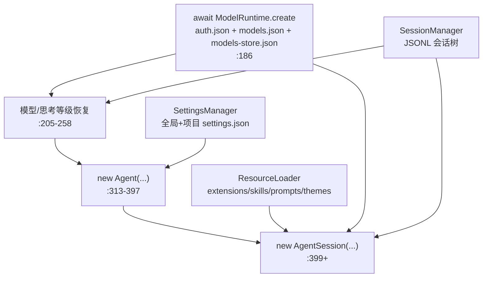

# 03 — packages/coding-agent core 深挖：AgentSession 与它的服务群

> 学习系列第 3 篇（全景第 0 篇、agent 运行时第 1 篇、ai 包第 2 篇）。第 2 篇从 sdk.ts:302 的 streamFn 闭包向 provider 侧走完了全程；本篇从同一行向上走：这个闭包所在的 `createAgentSession` 如何把 Agent、会话树、设置、鉴权、工具、扩展装配成一台可运行的机器。范围是 `src/core/`，但**扩展系统（extensions/）和三种运行模式（modes/）只讲到边界**——它们分别是第 5 篇和第 4 篇的主角。
>
> 所有 `文件:行号` 基于 commit `3f9aa5d1`。除特别注明外，路径相对 `packages/coding-agent/src/core/`。

> **修订说明（2026-07-20）**：fork 并入上游 v0.80.10（`3da591ab`）后，第 2 章和第 10 章已按新代码**就地改写**（旧 ModelRegistry/AuthStorage 组合被 `ModelRuntime` 服务群取代），这两章行号基于 fork 当前 HEAD（`3da591ab` + 注释提交，个别行号有几行浮动）；其余章节（会话树、压缩、重试、工具层、settings/trust）不受重构影响，行号仍基于 `3f9aa5d1`。

## 目录

- 第 1 章 地形图：26,700 行的服务群
- 第 2 章 装配现场：createAgentSession 走读（sdk.ts）
- 第 3 章 AgentSession：三千行"总机"的职责解剖
- 第 4 章 prompt() 的旅程与消息角色扩展
- 第 5 章 会话树（session-manager.ts）：JSONL 上的事件溯源
- 第 6 章 压缩的第二套实现与三通道触发
- 第 7 章 自动重试：指数退避与"历史留错、上下文除错"
- 第 8 章 工具层：ToolDefinition、Operations 注入与文件互斥
- 第 9 章 系统提示词：每轮重建的装配线
- 第 10 章 ModelRuntime 服务群：模型目录与凭证的装配层（v0.80.10 重写）
- 第 11 章 settings 与 project trust
- 第 12 章 不变量、判断与坑

---

## 第 1 章 地形图：26,700 行的服务群

`src/core/` 约 26,700 行，没有单一主线，而是一台"总机"（AgentSession）加一圈各管一摊的服务。按本系列的篇章归属划分：

```
─ 本篇主角
  agent-session.ts        3246  ★ 总机：生命周期、事件、压缩、重试、树导航
  session-manager.ts      1623  ★ JSONL 会话树
  settings-manager.ts     1232  双层设置合并
  model-runtime.ts         ~630 模型/认证中枢（v0.80.10 起，见第 10 章；
  + model-config/provider-composer/model-registry  取代旧 model-registry.ts 1007 行）
  compaction/*            ~1410 ★ 压缩与分支摘要（coding-agent 自己的实现！）
  model-resolver.ts        704  启动时选哪个模型
  auth-storage.ts          ~280 auth.json 文件锁存储（v0.80.10 起仅 CredentialStore）
  tools/*                 ~3500 ★ 七个内置工具 + 包装器 + 截断/互斥
  sdk.ts                   ~389 ★ 装配入口 createAgentSession
  agent-session-runtime.ts  433 cwd 级服务重建（/new 切目录用）
  system-prompt.ts          173 系统提示词模板
  messages.ts               195 ★ 自定义消息角色 + convertToLlm
  trust-manager.ts+project-trust.ts  340  项目信任
  bash-executor.ts          156  ! 命令的执行通道

─ 第 5 篇的主角（本篇只讲边界）
  extensions/*            ~3900 ExtensionRunner/loader/types
  package-manager.ts       2645 pi 包安装
  resource-loader.ts       1039 skills/prompts/themes/extensions 发现与加载

─ 杂项
  export-html/*            ~750 会话导出
  keybindings/footer/cache-stats/...  各 100-400
```

**判断**：如果说 agent 包是"引擎"、ai 包是"变速箱"，core 就是"整车线束"——没有精巧算法，全是协调逻辑：谁先启动、事件怎么转发、状态存哪里、坏了怎么兜底。读它的正确姿势不是逐行，而是抓住三条主线：**装配**（第 2 章）、**事件流转**（第 3 章）、**持久化**（第 5 章），其余服务都挂在这三条线上。

---

## 第 2 章 装配现场：createAgentSession 走读（sdk.ts）

sdk.ts 约 389 行（v0.80.10 修订），是理解整个包的最佳入口。`createAgentSession`（sdk.ts:178+）按依赖顺序装配：



与初版相比，左上角换人了：`AuthStorage → ModelRegistry` 两级装配变成一个 `await ModelRuntime.create({ authPath, modelsPath })`（:186）。注意它是**异步**的——构造中包含一次带 15 秒超时的模型目录刷新（恢复本地缓存 + 拉取 pi.dev 远端目录，第 10 章），这是 createAgentSession 变 async 链路上的最重一环。AuthStorage 没有出现在图里但仍然在场：ModelRuntime 内部默认用它当 `CredentialStore`。

几个值得停下来看的决定：

### 2.1 模型恢复的优先级链（sdk.ts:205-258）

续接会话时模型从哪来？顺序是：显式 `options.model` → 会话里记录的模型（`existingSession.model`，且必须 `modelRuntime.hasConfiguredAuth` 才用，:210-217）→ `findInitialModel`（settings 默认 → 各 provider 默认，:219-227）。任何一步失败都不 throw，而是积累 `modelFallbackMessage` 给 UI 显示——**启动路径的原则是降级不中断**。思考等级同理，最后用第 2 篇讲过的 `clampThinkingLevel` 夹到模型能力内（:258）。

### 2.2 streamFn 闭包：第 2 篇的起点，本篇的接点（v0.80.10 修订）

sdk.ts:321-351 的 streamFn 比初版薄了一层：**不再预解析密钥**（那件事下沉进了 pi-ai，02 篇 §2.3），只做 settings 参数补全（超时/重试，:322-330）和 header 定制，然后整体交给 `modelRuntime.streamSimple`（:333）。header 定制的方式也变了——不是先算好再传，而是注入一个 `transformHeaders` **回调**（:339-349）：pi-ai 在合并完认证与请求 headers 之后回调它，coding-agent 在里面叠归因 headers、再让扩展的 `before_provider_headers` 钩子过一遍。扩展因此看到的是"已合并的最终 header"，这是旧架构给不了的语义。

保留的细节：`timeout=0` 被换成 `2147483647`（:324-327）——SDK 把 0 理解为"立即超时"而不是"不超时"，用 max int32 实现"事实上的无超时"。

### 2.3 extensionRunnerRef：用可变引用解鸡生蛋

Agent 构造时需要挂扩展钩子（transformContext、onPayload…），但 ExtensionRunner 要等 AgentSession 构造时才创建。解法是一个共享的可变引用 `extensionRunnerRef: { current?: ExtensionRunner }`（sdk.ts:311），所有钩子在**调用时**才读 `ref.current`（:332、353、360、372）。额外红利：`reload()` 换新 runner 时只需改 ref，不用重装钩子（agent-session.ts:416-422 的注释明说了这个设计意图）。

### 2.4 convertToLlmWithBlockImages：动态读设置的防御层

sdk.ts:274+ 包装了 messages.ts 的 `convertToLlm`：若 `blockImages` 设置开启，把所有图片换成占位文本。注意它**每次调用都重新读设置**（注释 "Check setting dynamically so mid-session changes take effect"）——设置中途改动立即生效，不需要重启会话。这是 core 里反复出现的模式：不缓存设置值，每次问 SettingsManager。

---

## 第 3 章 AgentSession：三千行"总机"的职责解剖

agent-session.ts（3,246 行）的头注释列了职责清单：状态访问、事件订阅+持久化、模型/思考管理、压缩、bash、会话切换/分支。它被三种运行模式（interactive/print/rpc）共享，**模式只是 I/O 皮肤**——这是"一套核心三个前端"架构（第 0 篇 6 章）的支点。

### 3.1 事件流转：_handleAgentEvent 是全部持久化的入口

AgentSession 构造时就订阅 Agent 事件（:360），处理器 `_handleAgentEvent`（:548-619）做四件事，顺序固定：

1. **队列簿记**：user 消息开始时从 steering/followUp 显示队列里摘除（:551-569，先摘再发事件，UI 看到的队列状态永远是新的）；
2. **转发给扩展**（`_emitExtensionEvent`，:674-755，agent 事件逐个映射成扩展事件，message_end 还允许扩展**替换消息**）；
3. **转发给模式层监听器**（:575，agent_end 事件附加 `willRetry` 标志——UI 靠它决定错误是"终局"还是"即将重试"）；
4. **持久化**（:578-618）：message_end 时按角色写入会话树；顺带记录 `_lastAssistantMessage` 供压缩检查、成功响应即时清零重试计数（:609-616）。

一个刻意的可变操作值得看：扩展替换消息时用 `_replaceMessageInPlace`（:657-671）——把目标对象的键全删再 Object.assign。注释解释了原因：agent-core 的 state、后续事件、最终持久化都持有**同一个对象引用**，原地替换才能让所有持有方同步看到新内容。这和第 2 篇 calculateCost 一样，是"不可变原则"在引用一致性需求前让步的登记在册的例外。

### 3.2 _runAgentPrompt：post-run 决策循环

所有触发 LLM 的路径最终都进 `_runAgentPrompt`（:1023-1035）：

```typescript
await this.agent.prompt(messages);
while (await this._handlePostAgentRun()) {
    await this.agent.continue();
}
```

`_handlePostAgentRun`（:1037-1065）是"跑完一轮之后干什么"的决策器，按优先级：可重试错误 → 退避后 continue（第 7 章）；需要压缩 → 压缩后视情况 continue（第 6 章）；扩展在 agent_end 钩子里又排了消息 → continue 排空。**Agent 类自己的循环（第 1 篇第 7 章）负责一轮内的工具/steering，AgentSession 的这个 while 负责轮与轮之间的恢复性续跑**——两层循环各管一层。finally 里清一次性系统提示词覆盖、flush 挂起的 bash 消息、发 `agent_settled`（:1030-1034）——`agent_settled` 才是"真正空闲"信号，对应第 1 篇 11.3 节"agent_end ≠ idle"的坑。

---

## 第 4 章 prompt() 的旅程与消息角色扩展

### 4.1 六道关卡（agent-session.ts:1076-1224）

用户输入从 `prompt(text)` 到 LLM 要过六关，顺序即优先级：

1. **扩展命令**（:1084-1091）：`/xxx` 若是扩展注册的命令，立即执行并返回——**即使正在流式**（扩展命令自己管 LLM 交互）；
2. **扩展 input 事件**（:1096-1111）：扩展可吞掉（handled）或改写（transform）输入；
3. **skill/模板展开**（:1114-1118）：`/skill:name args` 内联成 `<skill>` 块（`_expandSkillCommand`，:1260-1284，读文件、剥 frontmatter、args 附尾）；`/template args` 走 prompt-templates.ts;
4. **流式分流**（:1121-1134）：正在流式则按 `streamingBehavior` 进 steer/followUp 队列，没指定就 throw；
5. **前置校验**（:1140-1161）：模型存在、鉴权配置齐、以及一次**发送前压缩检查**（:1158-1161，`skipAbortedCheck=false`——专门捕捉"上次被 abort 的响应已经超窗"的情况，此时不能靠 agent_end 触发压缩）；
6. **组装消息数组**（:1164-1212）：user 消息 + 挂起的 nextTurn 消息 + `before_agent_start` 扩展钩子注入的 custom 消息；扩展也可以在这里一次性覆盖系统提示词（`_systemPromptOverride`，用完即弃）。

### 4.2 消息角色扩展：declaration merging 的实战

第 1 篇 2.3 节讲过 AgentMessage 可扩展；messages.ts:70-77 就是实战——coding-agent 注入四种自定义角色：`bashExecution`（! 命令）、`custom`（扩展消息）、`branchSummary`、`compactionSummary`。`convertToLlm`（messages.ts:146-195）在 LLM 调用边界把它们统一翻译成 user 消息：bash 输出套代码块、两种摘要套固定前后缀标签、`excludeFromContext` 的 bash 消息（`!!` 前缀）直接滤掉。switch 尾部的 `_exhaustiveCheck: never`（:188）保证新增角色忘了写翻译会在编译期报错。

---

## 第 5 章 会话树（session-manager.ts）：JSONL 上的事件溯源

### 5.1 数据模型：append-only 树 + 唯一可变的 leaf 指针

会话文件是 JSONL：首行 `SessionHeader`（版本/id/cwd/父会话），其后每行一个 `SessionEntry`——九种类型（:140-149）：message、thinking_level_change、model_change、compaction、branch_summary、custom、custom_message、label、session_info。每个条目有 `id`（8 位十六进制，防撞，:217-224）和 `parentId`，构成树。**唯一的可变状态是 leaf 指针**（:802）：append 永远挂在 leaf 下并推进 leaf（`_appendEntry`，:975-980）；`branch(id)` 只是把 leaf 移回去（:1289-1294），旧分支原封不动。

连 label（书签）和会话改名都是追加条目而非修改（:1161-1182、1065-1076）——**整个文件没有一处原地更新，是教科书式的事件溯源**。代价是读取时要重放：`labelsById` 等索引在加载时重建，最新条目胜出。

### 5.2 延迟落盘：没有 assistant 回复就没有文件

`_persist`（:946-973）有个容易看漏的门槛：**文件在第一条 assistant 消息出现前不落盘**。之前的条目积在内存（`flushed=false`），首条 assistant 到达时用 `"wx"` 模式（存在即失败）一次性写入全部。效果：打开 pi 又直接退出、或只打了字没等到回复的会话，不会在 sessions 目录留下空壳文件。`createBranchedSession`（:1334-1434）严格遵守同一契约（:1399-1410 的注释点名了曾经的 duplicate-header bug）。

### 5.3 buildContextEntries：树到上下文的投影

发给 LLM 的内容 = `buildSessionContext`（:457-466）：从 leaf 走到根得到路径 → 找路径上**最后一条** compaction → 输出"compaction 条目 + firstKeptEntryId 起的保留条目 + compaction 之后的全部条目"（buildContextEntries，:414-450）。再经 `sessionEntryToContextMessages`（:379-404）投影成消息：compaction/branch_summary 变成带标签前缀的合成消息，纯 custom 条目（扩展状态）不参与上下文。这与第 1 篇 8.2 节 harness 的"只认最后一条 compaction"语义一致——但实现是各自独立的（见第 6 章）。

会话列表（`SessionManager.list`）为了性能用流式逐行解析 + 并发上限 10 的 info 构建（:705-745），头 512 字节快速嗅探 header（readSessionHeader，:544-560）——目录里几百个会话文件时 /resume 依然快。

### 5.4 树导航（navigateTree）与分支摘要

`/tree` 跳转走 agent-session.ts 的 `navigateTree`（:2799-2985）：计算旧 leaf 到目标的公共祖先、收集被放弃分支的条目、可选地让 LLM 生成分支摘要（`generateBranchSummary`）挂在新位置——**摘要挂在导航目标处而不是旧分支上**（:2936-2937 注释），因为它是给"接下来的对话"读的。目标是 user 消息时，leaf 退到其父节点、文本回填编辑器（:2917-2920）——"跳回去改问题重问"的交互就是这么实现的。扩展可以通过 `session_before_tree` 钩子取消、换摘要或改标签（:2851-2877）。

---

## 第 6 章 压缩的第二套实现与三通道触发

### 6.1 更正第 1 篇的一个论断

第 1 篇 1.2 节曾写"coding-agent 与 AgentHarness 共享 harness 里的压缩工具函数"——**这是错的**（已更正）。agent-session.ts:44-54 import 的 `compact`/`prepareCompaction`/`shouldCompact` 来自 coding-agent **自己的** `core/compaction/`。两套实现是近亲但平行：

- `core/compaction/compaction.ts`（872 行）：操作 `SessionEntry[]`（带树 id，`prepareCompaction(pathEntries, settings)`，:633-636），因为切点要落到会话树条目上（`firstKeptEntryId`）；
- `packages/agent/src/harness/compaction/`（第 1 篇第 10 章精读的那套）：操作 `AgentMessage[]`（`prepareCompaction(messages, …)`，harness/compaction/compaction.ts:545），是给不带会话树的 AgentHarness 宿主提炼的可移植版。

两边共享算法思想（锚点+增量估算、cut point、结构化摘要模板、被劈开 turn 的前缀摘要）但不共享一行代码。**判断**：这是 Agent/AgentHarness 平行封装（第 1 篇 1.2 节）在压缩子系统的精确复刻，同一个演化故事：先有 coding-agent 版，提炼出 harness 版，提炼后没有回头替换。给上游改压缩逻辑时**两处都要看**。

### 6.2 _checkCompaction 的三通道（agent-session.ts:1900-1989）

每轮结束（及每次 prompt 发送前）检查是否压缩，三条通道：

1. **溢出且需重试**：`isContextOverflow`（第 2 篇 11.1 节的方言博物馆）命中且 stopReason ≠ stop → 从 agent state 摘掉错误消息（**会话文件里保留**，:1951-1952 注释）→ 压缩 → continue 重试。`_overflowRecoveryAttempted` 保证**只试一次**（:1937-1950），防止"压了还溢出"的死循环；
2. **溢出但响应已完成**（stopReason = stop 却 usage 超窗，z.ai 式静默溢出）：只压缩不重试——"agent.continue() 无法从 assistant 消息续跑"（:1926-1929 注释）；
3. **阈值**：用量接近窗口 → 压缩，不重试，用户手动继续。

防误触发的两道时间戳守卫值得注意：assistant 消息早于最新 compaction 边界的不算数（:1916-1924）；错误/零用量消息估算时，usage 来源必须晚于压缩边界（:1970-1980）——否则"刚压缩完，旧消息的大 usage 又把压缩触发一遍"。**判断**：这两个守卫是典型的"从生产 bug 长出来的代码"，读它们比读任何设计文档都能理解压缩状态机的坑。

另外 `getSessionStats`（:3023-3076）与 `getContextUsage`（:3078-3122）的口径刻意不同：前者遍历**全部条目**（包括被压掉的历史）算真实账单；后者只看当前分支，且压缩后没有新的可信 usage 时返回 `tokens: null`——UI 显示"未知"而不是错误的旧值。

---

## 第 7 章 自动重试：指数退避与"历史留错、上下文除错"

`_prepareRetry`（agent-session.ts:2587-2637）实现重试策略（第 2 篇 11.2 节说过 pi-ai 只出"意见"，策略在这里）：

- **分类**：`_isRetryableError`（:2577-2581）先排除溢出（归压缩管），再问 `isRetryableAssistantError`；
- **预算**：`retryAttempt` 超过 `settings.maxRetries` 放弃（注意 :2595-2598 先加后减的小动作——保留计数让最终失败事件能报告"试了几次"）；
- **退避**：`baseDelayMs × 2^(attempt-1)`，sleep 可被 abort（:2618-2634）；
- **上下文清理**：错误 assistant 消息从 `agent.state.messages` 移除，但**会话文件里已经持久化**（:2611-2615）——与压缩通道同一原则：**历史是完整账本，上下文是干净工作台**。

成功的 assistant 响应"立即"清零计数（_handleAgentEvent :609-616，不等 agent_end）——防止一个多次 LLM 调用的长 turn 里计数跨调用累积。

---

## 第 8 章 工具层：ToolDefinition、Operations 注入与文件互斥

### 8.1 双表示：ToolDefinition 是真身，AgentTool 是投影

工具在 core 里有两个形态：`ToolDefinition`（extensions/types.ts 定义）是声明式全量描述——schema、execute、**renderCall/renderResult（工具自带 TUI 渲染）**、promptSnippet/promptGuidelines（工具自带系统提示词素材，第 9 章）、prepareArguments（参数修复钩子）；`AgentTool` 是 agent 包认识的运行时形态。`wrapToolDefinition` 做投影，AgentSession 维护**定义优先**的双注册表（`_toolDefinitions` + `_toolRegistry`，agent-session.ts:332-333），`_refreshToolRegistry`（:2397-2488）在扩展加载/重载时重算，allowlist/denylist（`--tools`/`--exclude-tools`）在这一层过滤。

**判断**：把渲染和提示词素材放进工具定义（而不是让 UI 层 switch 工具名）是这个设计最值得抄的部分——新工具（含扩展注册的）自动获得正确的显示和提示词条目，UI 零改动。edit 工具的 renderCall 甚至在**参数还在流式**时就异步算 diff 预览（edit.ts:363-389，`argsComplete` 才触发、`previewArgsKey` 防陈旧结果覆盖新参数），用户在模型还没停止输出时就能看到将要发生的修改。

### 8.2 Operations 注入：仓储模式在工具层

每个有副作用的工具都把 I/O 收进一个可替换的 Operations 接口：`EditOperations`（readFile/writeFile/access，edit.ts:74-87）、`BashOperations`（exec，bash.ts:56-74）等。默认实现是本地 fs/子进程；换一套 Operations 就把工具变成 SSH/容器远程执行——官方 gondolin 扩展（第 5 篇案例）就是这么做的。AgentSession 的 `executeBash` 也接受 `options.operations`（agent-session.ts:2678）。

bash 的本地实现（createLocalBashOperations，bash.ts:82-148）有一把工程细节：POSIX 上 detached 生成进程组、超时/abort 都走 `killProcessTree`（杀整棵树而非单进程）；某些 shell 用 stdin 传命令而非 argv（:96-107）；`waitForChildProcess` 避免被"分离的孙进程持有继承的 stdio"卡住不退出（:131-133 注释）。

### 8.3 file-mutation-queue：按 realpath 串行化写操作

`withFileMutationQueue`（tools/file-mutation-queue.ts）把对**同一真实路径**的变更串成队列（不同文件仍并行）：key 用 `realpath` 解析（软链接指向同一文件也互斥），文件不存在时退化到 resolve 路径；还有一个 `registrationQueue` 串行化"算 key + 排队"本身，防止两个调用同时算 key 产生竞态。edit/write 的执行都包在里面（edit.ts:312）。并行工具调用（第 1 篇 6.2 节）+ 同文件多次 edit 的组合之所以安全，靠的就是它。

edit 工具本体（edit.ts:308-362）的健壮性清单：abort 检查**不用事件监听器 reject**，而是每个 await 后查 `signal.aborted`（:313-317 注释——监听器 reject 会在文件操作还在飞时提前释放互斥队列）；剥 BOM 再匹配（模型不会输出隐形 BOM）；统一 LF 匹配、按原文件行尾风格还原；`prepareArguments`（:94-118）修复模型怪癖——Opus 4.6/GLM-5.1 会把 edits 数组发成 JSON 字符串，旧的 oldText/newText 单编辑格式也兼容。

---

## 第 9 章 系统提示词：每轮重建的装配线

系统提示词不是启动时算一次的字符串，而是一条每轮重跑的装配线：

1. **素材**：`buildSystemPrompt`（system-prompt.ts:28-173）= 基础身份段 + 工具清单（**只列有 promptSnippet 的工具**，:91-93）+ guidelines（工具的 promptGuidelines 去重合并，:96-122）+ pi 文档路径段 + `<project_context>`（AGENTS.md 等上下文文件）+ skills 清单（有 read 工具才附，skills 靠模型自己去 read）+ 日期和 cwd 收尾。用户自定义 prompt 走 :53-81 的替换分支，但 project_context/skills/日期照样追加。
2. **每轮刷新**：`_installAgentNextTurnRefresh`（agent-session.ts:473-494）往 Agent 的 `prepareNextTurnWithContext`（第 1 篇 2.2 节的回调）里挂了一层：每轮开始都重新取 `_systemPromptOverride ?? _baseSystemPrompt`、当前工具数组、当前模型/思考等级——**中途 /model、开关工具、扩展改提示词，下一轮立即生效**，不需要任何"刷新"动作。
3. **一次性覆盖**：扩展在 `before_agent_start` 返回的 systemPrompt 只作用于本次 run（`_runAgentPrompt` 的 finally 清除，:1031）。

---

## 第 10 章 ModelRuntime 服务群：模型目录与凭证的装配层（v0.80.10 重写）

本章初版讲的是 ModelRegistry 与 AuthStorage——02 篇 auth/ 的"旧世界原型"。v0.80.10 把预言兑现了：原型被拆解，pi-ai 的 Models 集合成为唯一主线，coding-agent 这边只剩"装配 + 组合 + 快照"三件事，收敛在 `ModelRuntime` 和它的配件文件里。本章按新代码重写；所有新文件都有中文注释，可对照走读。

### 10.1 职责拆分：一个类变五个文件

| 文件 | 行数级 | 职责 |
|---|---|---|
| model-runtime.ts | ~630 | 中枢 `ModelRuntime`，实现 pi-ai 的 `Models` 接口 |
| model-config.ts | ~270 | models.json 的不可变快照（读文件 → TypeBox 校验 → deepFreeze） |
| provider-composer.ts | ~560 | 把内置/models.json/扩展三层组合成一个 pi-ai `Provider` |
| auth-storage.ts | ~280 | auth.json 文件锁存储，降级为 `CredentialStore` 实现 |
| model-registry.ts | ~130 | 面向扩展 API 的同步兼容外观，内部全转发 ModelRuntime |

旧 ModelRegistry 的"三层合并"还在，但形态变了：不再是启动时算好一张模型大表，而是**每个 provider 组合成一个惰性对象**。`composeModelProvider`（provider-composer.ts:439）产出的 Provider 的 `getModels()` 是闭包，每次调用现算四层合成——内置列表 → models.json upsert（自定义模型同名替换、新名追加）→ 扩展注册整体替换 → `modelOverrides` 最后收尾（用户配置最高）。schema 定义搬进了 model-config.ts（ModelDefinitionSchema :153，宽松默认值仍为 Ollama/LM Studio 本地模型准备；ModelOverrideSchema :169），三类加载失败（读文件/JSON/schema）都不炸启动，错误进 `getError()` 冒泡为 UI 警告。

扩展的 `registerProvider` 也还是那个 API（agent-session.ts:2698-2708 绑定，注册后 `_refreshCurrentModelFromRegistry` 热替换当前模型对象），底下换成 `ModelRuntime.registerProvider`（model-runtime.ts:570）：先独立校验本次注册（坏配置抛错、不污染已存配置），再与既有注册按"已定义字段覆盖、未定义保留"合并——与旧契约逐条对齐，这正是兼容外观类 `ModelRegistry` 能缩到 130 行的原因。

### 10.2 ModelRuntime：装配、快照与两条刷新路径

`ModelRuntime.create`（model-runtime.ts:140）的装配顺序：AuthStorage 包上 `RuntimeCredentials`（--api-key 的内存覆盖装饰器，read/list 时盖过底层存储、永不落盘）→ `ModelConfig.load` → `FileModelsStore`（动态目录持久化到 models-store.json，复用 auth-storage 的文件锁后端）→ 每个内置 provider 包上 `withRemoteCatalog`（pi.dev 远端目录：4 小时节流、404 视为"无远端目录"、结果落盘、离线时从本地恢复）→ 首次 `refresh`，带 15 秒 AbortController 超时兜底，`PI_OFFLINE` 时只走缓存。

认证已经不归它管（在 pi-ai 的 `resolveProviderAuth` 里，02 篇 §10.1），它补的是 coding-agent 特有的两块：

- **模型级配置 headers**：`getAuth`（:391+）在 pi-ai 解析结果之上叠加 models.json/扩展的 per-model headers——这些 header 可引用环境变量，必须等 env 解析完才能展开。
- **UI 快照**：认证检查是异步的，TUI 的选择器/页脚要同步渲染。`ModelRuntimeSnapshot` 把"全部模型/可用模型/各 provider 认证状态"缓存成不可变对象整体替换。刷新分两条路径（:298/:304 的一对方法）：读路径 `refreshAvailability` 让并发读者共享同一个进行中的刷新；写路径 `forceRefreshAvailability` 强制排在旧刷新之后再刷——变更操作不能读到变更前启动的过期结果。`setRuntimeApiKey`（:415）还会先乐观更新快照再异步校正，保证 `--api-key` 场景模型立即可选。

### 10.3 AuthStorage 的现状与 authHeader 语义

auth.json 仍由 `FileAuthStorageBackend` 管理（auth-storage.ts:30-173：0600 权限、`proper-lockfile` 跨进程锁，同步自旋 + 异步退避双路径），但类本身只实现 pi-ai 的 `CredentialStore` 四方法（:176 起）——`modify` 在文件锁内执行读改写，OAuth 何时刷新由 pi-ai 的 `resolveStoredOAuth` 决定。初版结尾那句"原型 → 抽象的提炼路径"到此收尾：锁与存储留在了 coding-agent（它知道 auth.json 在哪），刷新编排上移进了 pi-ai（它知道 OAuth 语义）。

models.json 的 `apiKey`（`$ENV_VAR` 引用和命令形式，resolve-config-value.ts）与 `authHeader` 也换了家：`composeApiKeyAuth`（provider-composer.ts）把它们编进组合后 Provider 的 `ApiKeyAuth`——`check` 无副作用（命令形式只标记不执行，供列表展示），`resolve` 才真正取值；`authHeader: true` 才注入 `Authorization: Bearer`，因为有的 provider 用自定义 header 鉴权，擅自加 Bearer 会破坏请求。

---

## 第 11 章 settings 与 project trust

### 11.1 双层设置

SettingsManager 维护两个文件：全局 `~/.pi/agent/settings.json` 和项目 `<cwd>/.pi/settings.json`（settings-manager.ts:188-195），`deepMergeSettings` 合并、项目层胜出（:304）。Settings 接口（:82+）约 40 个字段，从模型默认值到 TUI 内边距无所不包；写回时按 scope 分别写对应文件（:226）。第 2 章说过的"每次读不缓存"模式让 `/reload` 之外的多数设置改动即时生效。

### 11.2 project trust：不信任 = 项目资源不存在

`resolveProjectTrusted`（project-trust.ts:46-96）的决策链：显式覆盖（--trust CLI）→ 项目根本没有需要信任的资源（`hasTrustRequiringProjectResources`）则直接放行 → 扩展的 `project_trust` 钩子（可代答，`remember` 则落存储）→ 存储的既往决定 → `defaultProjectTrust` 设置（always/never/ask）→ 无 UI 环境默认拒绝 → 弹选择器问用户。信任的语义是**是否加载 `.pi/` 项目级设置、扩展、并允许装项目包**——不信任时这些资源视同不存在，而不是"加载但受限"。**判断**：布尔而非粒度化的权限模型，换来实现简单和心智清晰；粒度化控制留给了扩展钩子。

---

## 第 12 章 不变量、判断与坑

### 12.1 系统不变量

1. **会话文件 append-only**：改名、打标签、换模型全是新条目；唯一可变的是 leaf 指针（第 5.1 节）。
2. **文件在首条 assistant 消息前不落盘**（第 5.2 节）：任何新建/分支路径都必须遵守，否则复现 duplicate-header bug。
3. **历史完整、上下文干净**：错误消息持久化进会话但从 agent state 移除（重试、溢出恢复两处，第 6/7 章）。
4. **上下文投影只认路径上最后一条 compaction**（第 5.3 节），与 harness 语义一致但实现独立。
5. **同一文件的变更串行**（file-mutation-queue），abort 检查必须在 await 之后而非事件监听器里（第 8.3 节）。
6. **设置动态读取**：不要缓存 SettingsManager 的返回值再自己失效。

### 12.2 值得抄走的设计

- **可变 ref 解装配环**（extensionRunnerRef，2.3 节）：钩子读 ref 而非闭包捕获实例，重载即换脑。
- **工具自带渲染与提示词素材**（8.1 节）：新工具零 UI 改动接入，流式参数期的 diff 预览是加分项。
- **Operations 注入**（8.2 节）：本地/远程执行的切换点收敛在一个窄接口上。
- **post-run 决策循环**（3.2 节）：重试/压缩/排队消息的恢复性续跑与 agent 内层循环解耦。
- **延迟落盘 + 事件溯源会话树**（第 5 章）：整套可直接移植到任何"对话历史要可分支"的系统。

### 12.3 坑（下游开发者视角）

- **压缩有两套**（6.1 节）：改 `core/compaction/` 不影响 AgentHarness 宿主，反之亦然；提 PR 时确认目标是哪套（或两套都改）。
- **agent_end 带 willRetry**：UI 若把 stopReason=error 直接画成终局，会在自动重试场景闪现假错误——先看 willRetry。
- **溢出恢复只试一次**（`_overflowRecoveryAttempted`）：压缩后仍溢出就放弃，报错建议换大窗口模型；不要在扩展里无脑重触发。
- **扩展命令不能进队列**（`_throwIfExtensionCommand`，:1364-1374）：流式期间 steer 一个 `/命令` 会 throw，模式层要预检。
- **getSessionStats ≠ getContextUsage**（6.2 节）：一个是全史账单、一个是当前分支上下文，别拿错口径。
- **models.json 的 compat 校验是三选一 Union**（model-config.ts:127-131，v0.80.10 后 schema 住这里）：字段拼错不会报"未知字段"而是整体匹配失败，报错信息可能指向别的 schema 分支。

### 12.4 与下一篇的接口

本篇止步于 AgentSession 的事件出口：`session.subscribe(listener)`（:762-772）交出去的 AgentSessionEvent 流。下一篇 `04-modes-and-tui.md` 讲三个消费者——InteractiveMode 如何把事件流画成差分渲染的 TUI（pi-tui 的组件模型、编辑器、键绑定）、print-mode 的一次性消费、RPC 模式的 JSON 协议——以及本篇多处出现的 `renderCall/renderResult`、`ExtensionUIContext` 在 UI 侧的另一半。

---

*初版基于 commit 3f9aa5d1；第 2、10 章于 2026-07-20 按 v0.80.10（`3da591ab`）修订。AgentSession 的公开方法与 AgentSessionEvent 是三种模式和扩展系统的共同依赖，属于这个包里最稳定的 API；会话文件格式有版本迁移机制（v1→v2→v3，session-manager.ts:226-292）保证旧会话永远可读。*
