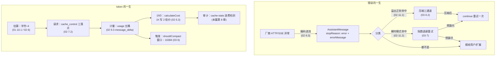

# 07 — 健壮性与成本：生产级 agent 的命与钱（横切篇·系列收官）

> 学习系列第 7 篇，最后一篇。前六篇按结构走（引擎、provider、core、前端、扩展、测试），本篇按两条**贯穿性主线**重走一遍：一条关于**命**——错误如何被表示、分类、重试、恢复；一条关于**钱**——token 如何被计量、缓存、估算、审计。素材大多在前篇出现过，本篇的增量是把散点连成完整机制链，并补上尚未走读的缓存浪费审计器（cache-stats.ts）。适合作为"给自己的 agent 项目抄作业"的清单来读。
>
> 所有 `文件:行号` 基于 commit `3f9aa5d1`。

## 目录

- 第 1 章 总图：错误的一生与 token 的一生
- 第 2 章 命·错误即数据：一条契约贯穿五层
- 第 3 章 命·重试的分层主权
- 第 4 章 命·溢出：方言识别到三通道恢复
- 第 5 章 命·上下文卫生学
- 第 6 章 钱·Usage 会计与 Anthropic 定价结构
- 第 7 章 钱·cache_control 的滚动前缀策略
- 第 8 章 钱·缓存浪费审计器（cache-stats.ts 走读）
- 第 9 章 钱·÷4 启发式的系统性影响
- 第 10 章 收官：可移植的检查清单

---

## 第 1 章 总图：错误的一生与 token 的一生



两条线在压缩处交汇：**压缩既是命的恢复手段（溢出自救），也是钱的开支项（一次真实的 LLM 调用）**——理解 pi 的很多细节（时间戳守卫、只试一次、压缩后缓存全失效）都要同时戴上这两副眼镜。

---

## 第 2 章 命·错误即数据：一条契约贯穿五层

pi 最重要的健壮性决定只有一句话（types.ts:296-303 的 StreamFunction 契约）：**失败不 throw，编码成 `stopReason: "error"|"aborted"` 的普通助手消息**。前六篇看到它在每一层的兑现，串起来是一条完整的责任链：

| 层 | 兑现点 | 篇章 |
|---|---|---|
| API 实现 | stream() 顶层 catch → error 事件（anthropic-messages.ts:727-737） | 02·9.3 |
| 装配层 | lazyStream 把 setup 失败物化成 error 流（lazy.ts:49-53）；dispatch 无实现同理 | 02·4 |
| agent 循环 | error/aborted 四行收尾，无旁路 try/catch（agent-loop.ts:196-200） | 01·4 |
| Agent 类 | 兜底 handleRunFailure 合成完整事件四连（防违约的 streamFn） | 01·7.4 |
| AgentSession | 错误消息照常持久化、进事件流，由分类器决定后续 | 03·3.1 |

连锁收益值得复述：错误能进会话历史（可回看）、能被 UI 当消息渲染（04·8 章的 message_end 分支）、能被正则分类（下一章）、能被测试用 fauxAssistantMessage 一行构造（06·5 章）。**判断**：这是整个仓库回报率最高的单一设计。它的对照组是常见的"异常层层上抛 + 每层 try/catch 翻译"——那种架构里，"重试时 UI 显示什么"这类问题需要额外的状态通道，而 pi 里它就是一条消息。

例外清单同样重要——只有**编程错误**才 throw：busy 时调 prompt（01·7）、扩展加载期调动作方法（05·2）、stale ctx（05·4）、组件行宽超限（04·2）。运行时错误走数据，程序员错误走异常，界线清晰。

---

## 第 3 章 命·重试的分层主权

pi 有四层"谁负责重试"，主权自下而上递交，每层的默认值都有明确理由：

1. **SDK 层：0 次**（anthropic-messages.ts:537 `maxRetries: options?.maxRetries ?? 0`）。厂商 SDK 自带的重试被刻意关闭——它不可观测（用户看不到"正在重试"）、不可中断、且会与上层重试叠乘。
2. **服务器指令层：60 秒上限**（StreamOptions.maxRetryDelayMs 注释，types.ts:165-172）。厂商 429 响应可能要求等待很久；超过上限直接失败，把等待请求**转换成一条可分类的错误消息**，让上层带着用户可见性处理——retry.ts:75 的 "retry delay" 模式（#1123）就是接住它的。
3. **pi 重试层：3 次、2s/4s/8s**（settings-manager.ts:812-818 默认值；执行在 03·7 章的 _prepareRetry）。分类权在 pi-ai 的 `isRetryableAssistantError`（02·11.2，带 issue 号的模式库 + 配额类反模式排除），执行权在 AgentSession（预算、退避、可 abort 的 sleep、事件通知 UI）。**成功立即清零计数**（03·3.1），防长 turn 内累积。
4. **用户层**：预算耗尽后 `auto_retry_end{success:false}` 报最终错误（04·8 章 UI 只在此刻打扰用户），Esc 随时可以砍掉正在退避的重试。

**判断**：这个分层的精髓是"**观测权和执行权在同一层**"——pi 层重试有事件、有状态条、有 Esc 手柄；假如让 SDK 层重试，这三样全没有。给自己的 agent 抄这个结构时，关键不是数字（3 次/2 秒），而是把下层重试关掉的纪律。

配套的超时体系：HTTP 空闲超时默认可配（`httpIdleTimeoutMs`），`0` 会被换成 max int32 而非直译（sdk.ts:310-312——SDK 把 0 当"立即超时"）；WebSocket 连接握手另有独立超时（types.ts:154-159）。

---

## 第 4 章 命·溢出：方言识别到三通道恢复

上下文溢出是唯一**不走重试**的错误类（`_isRetryableError` 第一行就排除它，agent-session.ts:2577-2581）——重试解决不了"输入太长"，只有压缩能。完整防线四段：

1. **识别**（02·11.1）：22 条错误正则 + 反模式排除（防 Bedrock 限流误判）+ 两种无错误信号的检测——静默接受型（usage.input 超窗，z.ai）和截断填满型（stopReason=length + 零输出 + 输入 ≥99% 窗口，Xiaomi）。**这张表是 pi 支持 30+ 厂商的隐性成本清单**：每接一家就可能多一条正则。
2. **预防**（02·6）：发请求前 maxTokens 夹紧留 4096 安全垫；每轮后 `shouldCompact`（阈值 = 窗口 − reserveTokens 16384）主动压缩，不等真溢出。
3. **恢复**（03·6.2 三通道）：真溢出且未完成 → 摘错误消息、压缩、continue 重试，`_overflowRecoveryAttempted` 保证**只试一次**（压了还溢出说明压缩救不了，换模型才是出路）；响应已完成但超窗 → 只压缩不重试（无法从 assistant 消息 continue）；阈值 → 压缩不重试。
4. **防误触发**（03·6.2）：两道时间戳守卫排除"压缩前的旧 usage/旧错误"再次触发压缩——没有它们，系统会在压缩完成后立刻再压一次。

压缩自身的失败处理也闭环：CompactionError 区分 aborted 与真失败（01·10.3），失败发 `compaction_end{errorMessage}` 不静默（03·6.2 的 catch），UI 对 manual/auto 用不同的打扰级别（04·8）。

---

## 第 5 章 命·上下文卫生学

前篇反复出现的一条原则值得单独命名——**历史是完整账本，上下文是干净工作台**：

- 重试/溢出恢复时，错误消息从 `agent.state.messages` 移除但**已持久化进会话文件**（03·6.2/7 章）；
- 跨模型重放时，error/aborted 的助手消息整条跳过、无签名 thinking 降级、孤儿 toolCall 补合成结果（02·8.1 transformMessages）；
- 压缩后上下文只认"最后一条 compaction + 保留区"（03·5.3），但 `getSessionStats` 仍遍历全史算真实账单（03·6.2 双口径）；
- 退出 plan-mode 后注入的指令消息被 context 钩子过滤（05·9 章"注入配清理"）。

四处代码互不相识，遵守同一条纪律。**判断**：这是 agent 系统特有的不变量——LLM 的上下文是"每次全量重放"的，任何残渣（半截 turn、过期指令、错误噪音)都会被模型当真。把"清上下文"和"删历史"区分开，是回看、审计、fork 这些功能得以存在的前提。

---

## 第 6 章 钱·Usage 会计与 Anthropic 定价结构

计量单位是 Usage 五桶（types.ts:352-373）：`input / output / cacheRead / cacheWrite（+cacheWrite1h 细分）/ reasoning（output 的子集）`。采集时机在 02·9.3 章：message_start 记初值（**abort 也有账**）、message_delta 增量覆盖非 null 字段、thinking_tokens 从 SDK 类型没收录的字段窄化读出。

计价在 `calculateCost`（models.ts:385-395，02·5.3），Anthropic 的价格结构用 claude-fable-5 的目录数字说话（providers/anthropic.models.ts:17-22，$/百万 token）：

| 桶 | 价格 | 相对 input |
|---|---|---|
| input | 10 | 1× |
| output | 50 | 5× |
| cacheRead | 1 | **0.1×** |
| cacheWrite（5 分钟） | 12.5 | 1.25× |
| cacheWrite（1 小时） | 20（= input×2，calculateCost 硬编码） | 2× |

这张表决定了 agent 场景的第一经济定律：**长会话里 90% 的输入 token 应该走 cacheRead 桶**。一个 20 万 token 上下文的会话，每轮全价重算是 $2，全缓存命中是 $0.2——十轮就差 $18。所以下一章的缓存策略不是优化，是生存必需。

`/session` 的账单（getSessionStats）与 footer 的上下文占用（getContextUsage）刻意分口径（03·6.2）：前者答"这个会话花了多少钱"（全史），后者答"离压缩还有多远"（当前分支，且压缩后没有新 usage 时诚实地显示未知）。

---

## 第 7 章 钱·cache_control 的滚动前缀策略

Anthropic 的 prompt 缓存按**前缀匹配**计费，`cache_control` 标记缓存断点。pi 的三落点（02·7.2，buildParams/convertTools/convertMessages）构成一个滚动策略：

1. **system prompt 尾**——最稳定的前缀，几乎永不失效；
2. **最后一个工具定义**——工具表大而稳定（每个工具的 JSON schema 数百 token），单独断点让"改系统提示词不作废工具缓存"；
3. **最后一条 user 消息的最后一个 block**——每轮把断点推到新末尾，第 N+1 轮恰好命中第 N 轮写入的前缀。

这个策略的失效模式清单（也是第 8 章审计器的归因分类）：**闲置超 5 分钟**（默认 TTL 过期，重写全额 1.25×）、**换模型**（缓存按模型隔离，全额重算）、**压缩/分支切换**（前缀本身变了——这不算浪费，是必要开支，审计器会豁免）、**上下文中段被改**（pi 的 append-only 消息设计基本杜绝了这类；03·5.1 的事件溯源在这里兑现了成本红利）。

retention 三档的权衡：short（5 分钟）适合交互节奏；long（1h，写价 2×）当且仅当"预期闲置 5 分钟到 1 小时再回来"时划算——盈亏平衡点是一次 TTL 过期重写的代价（1.25×）对 2× 的差价，闲置概率超过 ~60% 才值得。设置暴露为 `cacheRetention`，faux provider 连这个都能模拟（02·12 章的公共前缀缓存），相关行为可以在测试里断言。

---

## 第 8 章 钱·缓存浪费审计器（cache-stats.ts 走读）

前几章是"怎么省"，cache-stats.ts（164 行）是"漏了多少"——扫描会话账单，找出**本该命中缓存却全价重付**的 token。核心算法 `detectMiss`（:56-90）：

```typescript
const missedTokens = Math.min(prev.promptTokens, promptTokens) - usage.cacheRead;
```

上一轮的 prompt 全部应该在缓存里，本轮 prompt 与它的交集减去实际 cacheRead 就是浪费。精细处：

- **噪音地板 1024 token**（:11）：缓存断点粒度造成的小额差异不报；
- **多付单价 = 实付率 − 缓存读率**（:77-86）：浪费的 token 落在 input 或 cacheWrite 桶，用**本条消息自己的成本分解**反推实付单价，读率优先用实际值、缺了查价目表——避免对未知定价的厂商编数字；
- **归因字段**：`idleMs`（超过 CACHE_TTL_MS 5 分钟即可归因于过期，:8）与 `modelChanged`——UI 通知能告诉用户"这次浪费是因为你离开了 8 分钟/切了模型"；
- **豁免规则**（scan :112-119 注释）：compaction/branch_summary 重置基线——上下文合法变更不算浪费；**换模型不豁免**——它确实重付了全款，用户应该知道；
- **provider 能力探测**（:37-48 的 sticky `reportedCache`）：从未上报过缓存字段的厂商（不支持缓存）不产生误报，而 OpenAI 式"只报读不报写"的厂商全 miss 时能被正确计为浪费。

出口三个：`computeCacheWaste`（/session 的累计浪费）、`detectCacheMiss`（message_end 时的即时通知，`showCacheMissNotices` 设置控制，04·8 章的 maybeShowCacheMissNotice）、`collectCacheMisses`（重建聊天时恢复历史通知）。

**判断**：多数 LLM 应用连 usage 都不聚合，pi 做到了第三层——计量、计价之上还有**归因审计**。这 164 行是全仓库最值得原样抄走的文件之一：它不依赖任何 pi 特有结构（输入就是消息序列 + 价目表），却能直接回答"我的 agent 每月多花的那 30% 去哪了"。

---

## 第 9 章 钱·÷4 启发式的系统性影响

`estimateTokens` 的"字符数 ÷4"（01·10.1）在三个决策点使用，各有不同的误差容忍度：

| 使用点 | 低估的后果（CJK 场景） | 缓解 |
|---|---|---|
| 压缩触发（锚点后增量补估） | 压缩偏晚 → 撞真溢出 | 锚点机制限制误差范围；溢出恢复兜底 |
| maxTokens 夹紧（02·6） | 夹得偏松 → 请求被拒 | 4096 安全垫；溢出正则接住 |
| footer 上下文百分比 | 显示偏低 | 有真 usage 时优先用真值 |

**判断**：pi 对估算错误的态度是"允许错、保证兜"——每个使用÷4 的地方，下游都有一个用**真实信号**（provider usage、溢出错误）纠偏的机制。这比追求精确分词器（要按模型带词表、CJK 也各不同）更符合工程现实。中文重度用户该知道的实际影响：自动压缩会比英文会话更接近悬崖才触发，手动 `/compact` 的时机可以更主动些。

---

## 第 10 章 收官：可移植的检查清单

七篇走完，把可以带去任何 agent 项目的东西浓缩成两张清单。

### 命的清单

1. 错误编码成数据，随消息流走完全程；异常只留给编程错误（第 2 章）。
2. 关掉所有下层自动重试；重试与它的观测（事件/UI/取消）放同一层（第 3 章）。
3. 溢出与瞬时错误分家：前者压缩、后者退避，溢出自救只试一次（第 4 章）。
4. 历史与上下文分离：账本只增，工作台常擦（第 5 章）。
5. 每条防御守卫配一个 issue 号回归测试（06·5 章的事故博物馆）。

### 钱的清单

1. 五桶计量从 message_start 开始，abort 也要有账（第 6 章）。
2. 缓存断点跟着"最稳定前缀"走，逐轮滚动（第 7 章）。
3. 上下文结构 append-only——省缓存的最大头不在标记而在"别改前缀"（第 7 章）。
4. 计量之上做归因审计：浪费多少、因为什么（第 8 章）。
5. 估算可以糙，但每个估算点下游必须有真实信号纠偏（第 9 章）。

### 系列全图

```
00 全景地图 ──┬─ 01 agent（引擎：循环/事件/压缩）
              ├─ 02 ai（变速箱：streamSimple→SSE、方言、鉴权）
              ├─ 03 coding-agent core（线束：AgentSession/会话树/工具）
              ├─ 04 modes+tui（外壳：差分渲染/三消费者）
              ├─ 05 extensions（插件面：五种分发语义/两案例）
              ├─ 06 testing（横切：faux/harness/回归制度）
              └─ 07 robustness & cost（横切：命与钱）★ 本篇
```

读完这个系列后再进仓库，建议的第一个动手练习：挑 `test/suite/regressions/` 里一个感兴趣的 issue 号，先读测试、再读它守卫的生产代码、最后看 GitHub 上的原始 issue——三角互证是消化这个代码库最快的循环。

---

*基于 commit 3f9aa5d1。本篇引用的默认值（重试 3×2s、reserveTokens 16384、TTL 5min、噪音地板 1024）都是 settings 可覆盖或常量可改的，行为主线（分层主权、三通道、滚动缓存、归因审计）稳定。系列完结。*
